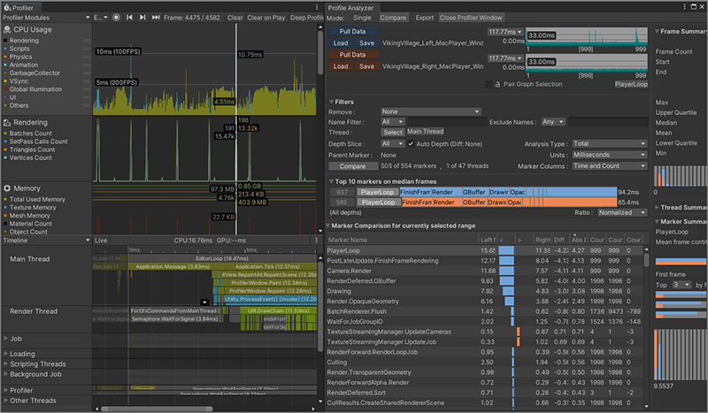

# Collecting and viewing data workflow

Follow this workflow to populate the Unity Profiler and Profile Analyzer with profiling data for performance analysis.

The Profile Analyzer analyzes CPU timing from the [Unity Profiler](https://docs.unity3d.com/Manual/Profiler.html) and `GC.Alloc` marker data for the GC allocation panels.

>[!NOTE]
>Captures taken with Unity versions that predate the `GC.Alloc` profiler marker, or captures that never recorded one in the selected range, display **No GC allocation data in capture** in the GC allocation panels.

To populate the Profiler and Profile Analyzer with profiling data, complete the following tasks in order:

1. [Open the Unity Profiler](#open-the-unity-profiler)
2. [Populate the Profiler with data](#populate-the-profiler-with-data)
3. [Pull data into the Profile Analyzer](#pull-data-into-the-profile-analyzer)
4. [Load and save Profile Analyzer data](#load-and-save-profile-analyzer-data)

## Open the Unity Profiler

The Unity Profiler must be open before you record or load a capture.

To open the Unity Profiler:

1. In the Unity Editor, go to **Window** &gt; **Analysis** &gt; **Profiler**, or press **Ctrl**+7 (macOS: **Cmd**+7).
2. If the Profile Analyzer window is already open, select **Open Profiler Window** instead.

## Populate the Profiler with data

The Profile Analyzer reads data from the Profiler. Record a new capture or load an existing `.data` file before you pull data into the Profile Analyzer.

### Record new data

To record new profiling data:

1. At the top of the **Profiler** window, open the **Attach to Player** dropdown (next to **Record**) and select a player to profile. The default target is **Playmode**.
2. Select **Record** to start recording.

If you enabled **Autoconnect Profiler** in **Build Settings**, the Profiler records data automatically when you start a built player.

Refer to [Profiling your application](https://docs.unity3d.com/Manual/profiler-profiling-applications.html) for more recording options.

### Load data

To load a saved Profiler capture:

1. In the **Profiler** window, select **Load**.
2. Choose a `.data` file.

## Pull data into the Profile Analyzer

To pull Profiler data into the Profile Analyzer:

1. Open the Profile Analyzer window (**Window** &gt; **Analysis** &gt; **Profile Analyzer**).
2. In the [Frame Control](frame-range-selection.md) pane, select **Pull Data**.

The Profile Analyzer imports the frames currently loaded in the Profiler.

>[!TIP]
>The Profiler window and the Profile Analyzer window use a lot of screen space. Dock both windows in one tabbed layout to switch between them quickly.

 *The Profile Analyzer in Compare view docked next to the Profiler in one window*

## Load and save Profile Analyzer data

Profile Analyzer saves analysis in the `.pdata` format, separate from Profiler `.data` captures.

To save Profile Analyzer data:

1. In any view, select **Save**.
2. Choose a location. Unity writes a `.pdata` file.

To load Profile Analyzer data:

1. In any view, select **Load**.
2. Choose a `.pdata` file.

>[!NOTE]
>Profile Analyzer **Load** accepts `.pdata` files only. To analyze a Profiler `.data` capture, open it in the Profiler first, then select **Pull Data** in the Profile Analyzer.

After you load or save data, analyze it in the [Profile Analyzer window](profile-analyzer-window.md) or continue with other pages under [Workflows](workflows.md).

## Additional resources

- [Profile Analyzer window](profile-analyzer-window.md)
- [Frame Control pane](frame-range-selection.md)
- [Single view](single-view.md)
- [Compare view](compare-view.md)
- [Workflows](workflows.md)
- [Unity Profiler](https://docs.unity3d.com/Manual/Profiler.html)
