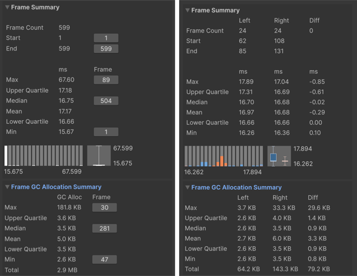

# Frame Summary

The Frame Summary pane displays a summary of the frame times for the range of data selected. This pane provides useful information about the frames in the data selection, including the maximum, minimum, upper and lower quartile, mean, and median timings.

 *The Frame Summary pane in Single view (left,) and Compare view (right)*

The Frame Summary pane is a good way for you to see at an overview what frames might be an outlier and how evenly distributed the timings are in the data set. For example, in the above screenshot, in the Compare view, while the median values are fairly similar, with little difference, the maximum frame value differs greatly, which suggests that the Right data set had more spikes in performance, that you could focus investigating further.

## Statistics

|**Statistic**|**Description**|
|---|---|
|**Frame Count**|The number of frames selected in the [Frame Control pane](frame-range-selection.md).  In Compare view, the **Left** count corresponds to the first data set loaded into the Profile Analyzer, colored blue, and the **Right** count corresponds to the second data set loaded into the Profile Analyzer, colored orange.   The **Diff** count is the difference in frame count between the Right and Left values. When this number is negative, it indicates that the Left frame count is larger than the Right frame count. When the Diff is a positive number, it means that the Right frame count is larger than the Left frame count.|
|**Start**|The frame number that the data selection starts on. In Single view, you can click the button next to this number to jump to the relevant frame in the Profiler window.|
|**End**|The frame number that the data selection ends on. In Single view, you can click the button next to this number to jump to the relevant frame in the Profiler window.|
|**Max**|The largest (maximum) frame time in the data selection. In Compare view, the Diff column shows the difference between the Right and Left timings.|
|**Upper Quartile**|Displays the upper [quartile](https://en.wikipedia.org/wiki/Quartile) of the data set. In Compare view, the Diff column shows the difference between the Right and Left timings.|
|**Median**|Displays the [median](https://en.wikipedia.org/wiki/Median) value of the data set. In Compare view, the Diff column shows the difference between the Right and Left timings.|
|**Mean**|Displays the [mean](https://en.wikipedia.org/wiki/Arithmetic_mean) value of the data set. In Compare view, the Diff column shows the difference between the Right and Left timings.|
|**Lower Quartile**|Displays the lower [quartile](https://en.wikipedia.org/wiki/Quartile) of the data set. In Compare view, the Diff column shows the difference between the Right and Left timings.|
|**Min**|The smallest (minimum) frame time in the data selection. In Compare view, the Diff column shows the difference between the Right and Left timings.|

Underneath the statistics, the Profile Analyzer displays the timings as a histogram and box and whisker plot. For further information on the statistics available and how to analyze them, refer to [Statistics reference](statistics.md).

## Frame GC Allocation Summary

Directly below the Frame Summary, the **Frame GC Allocation Summary** foldout reports the equivalent statistics for **GC allocation bytes per frame** over the selected frame range. The Profile Analyzer derives these from the `GC.Alloc` profiler marker, so the panel reports per-frame totals across all sampled threads, not just the main thread.

In Single view, each row shows the statistic, the value (formatted by `EditorUtility.FormatBytes`), and, where applicable, the frame index that produced the value. In Compare view the panel uses the same Left / Right / Diff layout as the rest of the Compare view summaries.

|**Statistic**|**Description**|
|---|---|
|**Max**|The largest single-frame GC allocation in the selected range. Click the frame button next to the value to jump to that frame in the Profiler.|
|**Upper Quartile**|The upper [quartile](https://en.wikipedia.org/wiki/Quartile) of per-frame allocation bytes.|
|**Median**|The [median](https://en.wikipedia.org/wiki/Median) per-frame allocation, with a jump-to-frame button on the frame where the median value occurs.|
|**Mean**|The [mean](https://en.wikipedia.org/wiki/Arithmetic_mean) per-frame allocation across the selected frames.|
|**Lower Quartile**|The lower [quartile](https://en.wikipedia.org/wiki/Quartile) of per-frame allocation bytes.|
|**Min**|The smallest per-frame GC allocation in the selected range, with a jump-to-frame button. A frame with no GC allocations reports 0 bytes; click the button to jump to the first such frame.|
|**Total**|The sum of GC allocation bytes across all selected frames.|

If the loaded capture has no `GC.Alloc` marker, for example when the capture predates the marker or it was filtered out before recording, the panel displays **"No GC allocation data in capture"** instead. In Compare view this message appears only when **neither** data set has GC allocation data; if one side has it and the other does not, the missing side's values render as zero.
