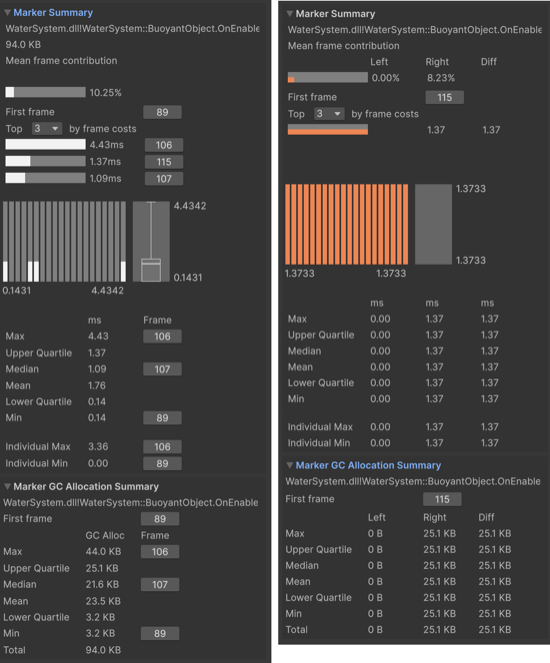

# Marker Summary pane reference

Explore the statistics in the Marker Summary pane to analyze timing and GC allocation for the selected marker.

The **Marker Summary** pane appears in the [Profile Analyzer window](profile-analyzer-window.md) when you select a marker in the **Marker details** list (Single view) or **Marker Comparison** list (Compare view). Use it to review how much time a marker contributes to the selected frame range. For definitions of **Min**, **Max**, **Median**, and related values, refer to [Statistics reference](statistics.md).

## Marker Summary pane statistics

The Marker Summary pane contains the following statistics.

 The Marker Summary pane in Single view (left) and Compare view (right).

| **Statistic** | **Description** |
| --- | --- |
| **Marker name** | Displays the name of the selected marker. |
| **Mean frame contribution** | Displays the marker's mean frame contribution as a percentage of the data set's total time. |
| **First frame** | Displays a link to the frame where the marker first appeared. Select the button to jump to that frame in the **Profiler** window. |
| **Top by frame costs** | Displays the longest occurrences of the marker in the data set. Use the dropdown to list up to 10 entries. |
| **Max** | Displays the largest (maximum) frame time in the data selection. In Compare view, the **Diff** column shows the difference between the right and left timings. |
| **Upper Quartile** | Displays the upper [quartile](https://en.wikipedia.org/wiki/Quartile) of the data set. In Compare view, the **Diff** column shows the difference between the right and left timings. |
| **Median** | Displays the [median](https://en.wikipedia.org/wiki/Median) value of the data set. In Compare view, the **Diff** column shows the difference between the right and left timings. |
| **Mean** | Displays the [mean](https://en.wikipedia.org/wiki/Arithmetic_mean) value of the data set. In Compare view, the **Diff** column shows the difference between the right and left timings. |
| **Lower Quartile** | Displays the lower [quartile](https://en.wikipedia.org/wiki/Quartile) of the data set. In Compare view, the **Diff** column shows the difference between the right and left timings. |
| **Min** | Displays the smallest (minimum) frame time in the data selection. In Compare view, the **Diff** column shows the difference between the right and left timings. |
| **Individual Max** | Displays the maximum value of a single marker instance. |
| **Individual Min** | Displays the minimum value of a single marker instance. |

## Marker GC Allocation Summary foldout statistics

The **Marker GC Allocation Summary** foldout appears directly below the Marker Summary pane. It reports per-frame GC allocation byte statistics for the selected marker over the selected frame range. Profile Analyzer derives these values from the `GC.Alloc` profiler marker attributed to the selected marker. Allocations from child markers do not count toward the selected marker's totals.

The foldout header repeats the selected marker name. If the marker has at least one allocation in the selected range, a **First frame** row includes a button that jumps to the first frame with a non-zero allocation. If the marker has no allocations in the selected range, Profile Analyzer hides the **First frame** row and the per-row jump-to-frame buttons.

The Marker GC Allocation Summary foldout contains the following statistics.

| **Statistic** | **Description** |
| --- | --- |
| **First frame** | Displays the first frame in the selected range where the marker recorded a non-zero allocation. Select the button to jump to that frame in the **Profiler** window. Hidden when the marker has zero allocations in the range. |
| **Max** | Displays the largest single-frame allocation attributed to this marker, with a jump-to-frame button. |
| **Upper Quartile** | Displays the upper [quartile](https://en.wikipedia.org/wiki/Quartile) of per-frame allocation bytes for the marker. |
| **Median** | Displays the [median](https://en.wikipedia.org/wiki/Median) per-frame allocation for the marker, with a jump-to-frame button on the frame where the median value occurs. |
| **Mean** | Displays the [mean](https://en.wikipedia.org/wiki/Arithmetic_mean) per-frame allocation for the marker across the selected frames. |
| **Lower Quartile** | Displays the lower [quartile](https://en.wikipedia.org/wiki/Quartile) of per-frame allocation bytes for the marker. |
| **Min** | Displays the smallest per-frame allocation attributed to this marker, with a jump-to-frame button. |
| **Total** | Displays the sum of GC allocation bytes attributed to this marker across all selected frames. |

>[!NOTE]
>The foldout reports allocation **bytes**, not the number of allocation events. The per-marker allocation event count is available in the **GC Alloc Count** column in the [Single view](single-view.md) and [Compare view](compare-view.md) marker tables.

If the loaded capture has no `GC.Alloc` marker, the foldout displays **No GC allocation data in capture** instead.

## Additional resources

- [Reference](reference.md)
- [Profile Analyzer window](profile-analyzer-window.md)
- [Single view](single-view.md)
- [Compare view](compare-view.md)
- [Statistics reference](statistics.md)
- [Frame Summary](frame-summary.md)
- [Unity Profiler](https://docs.unity3d.com/Manual/Profiler.html)
