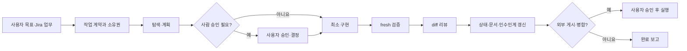

# Codex AI 자동 업무 관리 시스템 사용자 매뉴얼

> **TL;DR** 프로젝트 루트를 Codex에서 열고 현재 상태를 브리핑받은 뒤, Jira 업무 키와 원하는 결과를 말합니다. Codex는 작업 계약과 파일 소유권을 먼저 고정하고, 승인된 범위에서 구현·검증·리뷰·문서 현행화를 수행합니다. Jira·GitHub 쓰기, 외부 스킬 설치, push·PR·merge 같은 외부 변경은 사용자가 명시적으로 승인합니다.

## 1. 이 시스템이 하는 일

이 시스템은 Codex를 단순 코드 생성기가 아니라 프로젝트 규칙과 완료 기준을 따르는 개발 파트너로 사용하기 위한 작업 하네스입니다.

- `AGENTS.md`가 모든 에이전트가 지켜야 할 프로젝트 계약을 제공합니다.
- `.ai/task.md`가 지금 수행할 단 하나의 작업 범위를 정의합니다.
- `.ai/ownership.md`가 같은 파일을 두 에이전트가 동시에 수정하지 못하게 합니다.
- 프로젝트 스킬이 분석·구현·디버깅·검증·리뷰·인수인계 절차를 재사용합니다.
- Codex 훅이 프로젝트 시작 점검, 민감 파일 차단, 변경 후 검증, 문서 현행화 게이트를 자동화합니다.
- Jira가 업무 상태의 정본이고, GitHub Issue와 PR이 코드 변경과 리뷰를 연결합니다.
- 테스트 결과, 종료 코드, 라이브 증거를 기준으로 완료를 판정합니다.

핵심 원칙은 다음과 같습니다.

1. 사람은 무엇을 왜 만들지, 우선순위, 위험 수용, 병합 여부를 결정합니다.
2. Codex는 탐색, 계획 초안, 반복 구현, 테스트, 리뷰, 문서 동기화를 수행합니다.
3. 저장소 파일과 실행 증거가 기억의 정본입니다. 긴 대화나 과거 보고를 최신 사실로 간주하지 않습니다.
4. 완료는 자신감 표현이 아니라 수용 기준과 fresh 검증으로 증명합니다.

## 2. 처음 한 번 준비하기

### 2.1 프로젝트 루트 열기

Codex에서 다음 폴더를 프로젝트로 엽니다.

```text
logh7-revival/
```

하위 폴더가 아니라 `AGENTS.md`, `.ai/`, `docs/`, `scripts/`가 보이는 저장소 루트를 여는 것이 가장 안전합니다. 하위 폴더에서 시작해도 훅은 Git 루트를 찾지만, 사용자가 파일 구조를 확인하기는 루트가 편합니다.

### 2.2 프로젝트 훅 신뢰하기

새 훅이 추가되거나 hash가 바뀌면 Codex의 `/hooks` 화면에서 내용을 확인하고 프로젝트 훅을 신뢰합니다. 신뢰 전에는 자동 보호·검증이 실제로 활성화됐다고 가정하지 않습니다.

신뢰하지 않았거나 훅 상태가 불명확하면 다음과 같이 요청합니다.

```text
프로젝트 훅의 현재 활성 상태를 확인해 줘. 신뢰가 필요한 훅과 수동 대체 명령을 알려줘. 아직 파일은 수정하지 마.
```

### 2.3 스킬 상태 확인하기

프로젝트를 열면 SessionStart 훅이 로컬 스킬 상태를 점검합니다. 이 단계는 네트워크를 사용하거나 스킬을 자동 설치하지 않습니다.

수동 점검 명령은 다음과 같습니다.

```bash
bash scripts/agent/bootstrap-skills.sh --check
```

- `OK`: 프로젝트가 요구하는 스킬을 찾았습니다.
- `MISSING`: 필요한 스킬이 없습니다.
- `STALE`: 설치본과 잠금 정보가 다릅니다. 자동 덮어쓰지 않고 검토가 필요합니다.

전문 작업에 필요한 스킬이 없으면 다음처럼 요청합니다.

```text
$logh7-skill-manager 이 업무에 필요한 전문 스킬이 기존 프로젝트에 있는지 먼저 확인해 줘.
없다면 skills.sh에서 후보를 검색하고, 출처·SKILL.md·스크립트·권한을 검토한 결과와 dry-run만 보여줘. 아직 설치하지 마.
```

검토 결과를 승인한 뒤에만 설치를 요청합니다.

```text
검토한 <owner/repo>의 <skill-name>을 프로젝트 범위에만 설치해. 전역 설치와 기존 스킬 덮어쓰기는 금지해.
```

설치 위치는 `.agents/skills/`입니다. 새 스킬은 Codex가 자동 발견할 수 있도록 새 작업을 열어야 할 수 있습니다.

## 3. 프로젝트를 열자마자 하는 일

첫 요청은 구현이 아니라 브리핑으로 시작하는 것이 좋습니다.

```text
이 프로젝트의 현재 상태를 읽기 전용으로 브리핑해 줘.
.ai/task.md, decisions, current-state, handoff, ownership과 문서 라우터를 확인하고,
현재 목표, 열린 Jira 업무, 블로커, 다음 권장 작업을 알려줘. 파일과 외부 시스템은 수정하지 마.
```

Codex는 다음 순서로 현재 맥락을 복구합니다.

1. `.ai/task.md`: 현재 작업 계약을 확인합니다.
2. `.ai/decisions.md`: 사람이 승인한 결정을 확인합니다.
3. `docs/agent/README.md`: 작업 유형에 필요한 문서만 선택합니다.
4. `.ai/current-state.md`, `.ai/handoff.md`: 이전 세션의 verified 상태와 다음 행동을 복구합니다.
5. `.ai/ownership.md`: 다른 에이전트가 수정 중인 파일을 확인합니다.

대화 기록이 길거나 새 작업을 열었더라도 이 파일들만 최신이면 같은 상태에서 재개할 수 있습니다.

## 4. 업무를 선택하고 시작하기

### 4.1 Jira에서 업무 선택하기

Jira 커넥터가 현재 Codex 작업에 노출되어 있으면 자연어로 백로그를 조회할 수 있습니다.

```text
Jira LOGH7 프로젝트의 해야 할 일 중 우선순위가 높은 업무를 보여줘.
상위 업무, 하위 작업, 완료 기준, 선행 조건을 함께 요약해. 아직 상태는 바꾸지 마.
```

특정 업무를 시작하려면 Jira 키를 지정합니다.

```text
$logh7-start-task LOGH7-58을 시작해.
Jira 설명과 연결된 GitHub Issue를 확인하고, 구현 전에 목표·범위·비범위·Allowed files·수용 기준·검증 명령·승인 지점을 계약으로 정리해 줘.
```

Jira 커넥터가 없는 작업에서는 로컬 `.ai/task.md`와 계획 문서를 정본으로 사용합니다. 연결 부재를 이유로 임의의 Jira 상태를 추측하지 않습니다.

### 4.2 새 아이디어로 시작하기

티켓이 아직 없다면 문제와 가치를 먼저 설명합니다.

```text
$logh7-start-task
문제: <현재 불편 또는 실패>
사용자 가치: <해결되면 달라지는 결과>
원하는 결과: <관찰 가능한 결과>
제약: <바꾸면 안 되는 것>

코드는 수정하지 말고, 측정 가능한 수용 기준과 구현 가능한 티켓으로 분해해 줘.
Jira와 GitHub 생성은 계획을 보여준 뒤 내 승인을 받아.
```

큰 업무는 다음 계층으로 관리합니다.

| 계층 | 의미 | 예시 |
|---|---|---|
| Epic | 마일스톤·큰 목표 | M4 관측 게이트 |
| Story | 사용자 결과·기능 게이트 | 두 계정 월드 진입 |
| Task | 승인 가능한 작업 계약 | 월드 진입 서버 슬라이스 |
| Sub-task | 독립 구현·검증 가능한 S급 단위 | decoder 구현, 영속성 테스트 |

Jira는 상태 정본으로 사용하고, GitHub Issue 제목은 `[LOGH7-123] 제목` 형식으로 연결합니다.

### 4.3 계획 승인하기

Codex가 만든 계획에서 다음 항목을 확인합니다.

- 해결할 문제가 한 문장으로 명확한가?
- 사용자에게 보이는 결과가 있는가?
- 범위와 비범위가 구분됐는가?
- 수정 가능한 파일이 실제 경로로 제한됐는가?
- 수용 기준이 테스트나 관찰로 판정 가능한가?
- 외부 쓰기와 사람 결정 지점이 표시됐는가?

충분하면 다음처럼 승인합니다.

```text
이 계획과 작업 계약을 승인해. 승인된 Allowed files 안에서만 구현해.
검증 통과 전 완료라고 하지 말고, push·PR·merge는 하지 마.
```

범위가 마음에 들지 않으면 구현 전에 수정합니다.

```text
계획에서 <항목>은 제외하고 <항목>을 수용 기준에 추가해. 수정된 계약만 다시 보여줘.
```

## 5. 작업 유형별로 Codex 지휘하기

자연어로 요청해도 되지만, 원하는 절차가 분명하면 프로젝트 스킬을 명시합니다.

| 원하는 일 | 스킬 | 사용 시점 |
|---|---|---|
| 작업 계약 생성·재개 | `logh7-start-task` | 새 업무 시작, 중단 업무 재개 |
| 읽기 전용 조사 | `logh7-analyze` | 영향 범위, RE, 프로토콜, 대안 비교 |
| 승인 범위 구현 | `logh7-implement` | ACTIVE 계약과 소유권이 확보된 뒤 |
| 근본 원인 분석 | `logh7-debug` | 오류, 테스트 실패, 예상 밖 동작 |
| fresh 검증 | `logh7-verify` | 구현 후, 완료 주장 전 |
| 읽기 전용 리뷰 | `logh7-review` | 병합 전, 다른 에이전트 결과 검토 |
| 중단·인수인계 | `logh7-checkpoint` | 세션 종료, 긴 작업 중단, 에이전트 교체 |
| 외부 스킬 탐색·검토 | `logh7-skill-manager` | 프로젝트 스킬로 처리할 수 없는 반복 업무 |

### 분석만 요청하기

```text
$logh7-analyze LOGH7-54를 구현하지 말고 분석해.
Verified, Inferred, Unknown을 구분하고, 관련 코드·테스트·증거, 대안 2개 이상, 가장 작은 다음 실험을 보고해.
```

분석 요청은 저장소와 외부 시스템을 변경할 권한을 포함하지 않습니다.

### 구현 요청하기

```text
$logh7-implement 승인된 LOGH7-58 계약을 구현해.
작은 회귀 테스트로 실패를 먼저 관찰하고 최소 수정해.
변경 파일별 검증과 관련 통합 테스트를 실행하고 diff를 직접 검토해.
```

### 디버깅 요청하기

```text
$logh7-debug
증상: <오류 원문>
재현 명령: <명령>

가설을 세우고 가장 싼 판별 실험부터 실행해. 원인이 확정되기 전에는 수정하지 마.
수정 권한은 승인된 계약 범위에 한정해.
```

### 검증과 리뷰를 분리하기

```text
$logh7-verify 현재 변경을 수용 기준별 검증 ledger로 만들어 줘.
PASS, FAIL, NOT RUN을 구분하고 각 명령과 종료 코드를 적어.
```

```text
$logh7-review 현재 diff를 수정하지 말고 리뷰해.
BLOCKER, MAJOR, MINOR, QUESTION 순으로 실제 위험과 근거만 보고해.
```

## 6. 자동 업무 흐름



실제 내부 순서는 다음과 같습니다.

1. Explore: 정본 문서, 코드, 테스트, 현재 상태를 읽습니다.
2. Plan: 문제·가치·범위·수용 기준·검증 계획을 계약으로 만듭니다.
3. Implement: 승인된 파일 안에서 최소 변경합니다.
4. Verify: 변경 유형별 fresh 명령을 실행하고 종료 코드를 기록합니다.
5. Review: diff와 수용 기준을 대조하고 실제 결함을 찾습니다.
6. Update state: 관련 현행 문서와 `.ai/current-state.md`를 갱신합니다.
7. Handoff: `.ai/handoff.md`만 읽어도 재개할 수 있게 기록합니다.
8. Report: 변경, 검증, 미실행 항목, 남은 일, 사람 결정을 구분합니다.

## 7. 자동 처리와 사용자 승인 경계

| 작업 | Codex가 바로 수행 가능한 범위 | 명시적 사용자 승인 필요 |
|---|---|---|
| 읽기·검색·상태 확인 | 저장소와 연결된 시스템의 읽기 전용 조회 | 비밀 파일 읽기는 승인으로도 허용되지 않음 |
| 파일 수정 | ACTIVE 계약의 Allowed files, 확보한 소유권 안 | 계약 밖 파일, 큰 범위 변경 |
| 테스트·정적 검사 | 관련 검증 명령 실행 | 테스트 삭제·약화·skip |
| commit | 검증 통과 후 작업 브랜치 commit | main 직접 commit, history rewrite |
| Jira·GitHub Issue 쓰기 | 사용자가 생성·수정·상태 변경을 요청한 범위 | 요청하지 않은 외부 쓰기 |
| 외부 스킬 | 후보 검색·검토·dry-run | reviewed 설치, 업데이트, 네트워크 의존 변경 |
| push·PR·merge | 사전 diff·검증·리뷰 준비 | push, PR 생성, merge 각각 |
| 배포·삭제·운영 변경 | 읽기 전용 진단과 실행 계획 | 배포, 데이터 삭제, 인프라 변경, rollback 실행 |
| 아키텍처·캐논 판정 | 근거 수집과 대안 비교 | 최종 결정과 위험 수용 |

여러 동작을 한 번에 승인하려면 범위를 명확히 말합니다.

```text
현재 작업 브랜치의 검증된 변경만 commit하고 push해. 준비된 PR을 생성하되 merge는 하지 마.
```

`push`, `PR 생성`, `merge`는 서로 다른 외부 변경입니다. 한 동작의 승인을 다음 동작으로 자동 확대하지 않습니다.

## 8. Jira와 GitHub로 업무 관리하기

### 현재 업무 보기

```text
Jira LOGH7의 미완료 업무를 Epic→Story→Task→Sub-task로 묶어 보여줘.
각 항목의 크기, 블로커, 완료 기준, 연결된 GitHub Issue를 요약해. 변경하지 마.
```

### 큰 업무 세분화하기

```text
현재 L 업무와 분해 가능한 M 업무를 0.5~2일 안에 독립 검증할 수 있는 S급 하위 작업으로 나눠 줘.
중복을 먼저 확인하고 계획을 보여줘. 승인 후 Jira 하위 작업과 GitHub Issue를 1:1 생성해.
```

좋은 하위 작업은 다음 조건을 만족합니다.

- 하나의 주된 산출물 또는 검증 결과를 가집니다.
- 제목이 행동 동사와 대상을 포함합니다.
- 완료 기준이 체크리스트로 판정 가능합니다.
- 선행 작업과 상위 Jira 키를 기록합니다.
- GitHub Issue에 Jira 링크를 넣고, 상위 Jira에 대응 링크를 남깁니다.

### 작업 상태 변경하기

```text
LOGH7-123의 현재 증거와 GitHub 상태를 확인해. 완료 기준이 모두 충족된 경우에만 Jira를 완료로 전환하고, 근거 링크를 댓글로 남겨.
```

검증되지 않은 구현 보고만으로 Jira를 완료 처리하지 않습니다.

## 9. 검증과 완료 판정

기본 검증 진입점은 다음과 같습니다.

```bash
bash scripts/agent/verify-changes.sh --file <변경 파일>
bash scripts/agent/verify-changes.sh --full
cd server && npm test
```

모든 명령을 항상 실행하는 것은 아닙니다. `docs/agent/verification.md`의 변경 유형별 행렬에 따라 필요한 최소 검증을 선택합니다.

완료 보고에는 반드시 다음이 포함됩니다.

- 변경 파일 목록
- 실행한 명령과 종료 코드
- 수용 기준별 PASS 또는 FAIL
- 실행하지 않은 검증과 이유
- fresh 라이브 증거가 필요한지 여부
- 남은 일과 필요한 사람 결정

원본 클라이언트에 보이는 변화는 자동 테스트만으로 완료라고 할 수 없습니다. 현재 binary hash와 실행 환경에 맞는 격리된 runtime에서 수집한 라이브 증거가 필요합니다. native Windows는 Wine 없이 직접 실행하고, macOS/Linux만 run 전용 Wine prefix를 사용합니다.

## 10. 실패했을 때

### 같은 시도를 반복하지 않기

다음 중 하나에 도달하면 Codex는 같은 접근을 멈추고 블로커를 보고해야 합니다.

- 같은 증상으로 3회 실패했습니다.
- 새 증거 없이 조사만 2회 반복했습니다.

사용자는 다음처럼 접근 전환을 요구할 수 있습니다.

```text
같은 명령을 반복하지 마. 지금까지의 증거, 기각된 가설, 남은 가설, 가장 싼 다음 실험을 정리해.
도구·권한·환경이 블로커라면 필요한 사람 행동을 한 문장으로 알려줘.
```

### 테스트가 실패했을 때

- 실패 테스트를 삭제하거나 assertion을 약화하지 않습니다.
- 환경 오류와 제품 성공을 혼동하지 않습니다.
- 오류 원문, 재현 명령, 종료 코드를 보존합니다.
- 수정 후 재현 케이스와 관련 회귀 검증을 모두 다시 실행합니다.

## 11. 긴 작업을 중단하고 재개하기

중간에 멈춰야 하면 체크포인트를 요청합니다.

```text
$logh7-checkpoint 지금 작업을 안전하게 중단할 수 있게 체크포인트를 만들어 줘.
verified 사실과 추측, 실행한 검증과 미실행 검증을 분리하고, 다음 한 단계와 소유 중인 파일을 기록해.
```

새 작업에서 재개할 때는 다음처럼 요청합니다.

```text
$logh7-start-task 이전 작업을 재개해.
.ai/current-state.md와 .ai/handoff.md를 기준으로 현재 diff와 검증 상태를 대조하고, 오래된 정보는 fresh 확인해.
```

Codex는 `.codex/state/<session-hash>/`를 사용하므로 여러 Codex 작업의 훅 상태가 섞이지 않습니다. 그러나 제품 상태의 정본은 계속 `.ai/`와 저장소 문서입니다.

## 12. 권장 사용자 프롬프트 모음

### 오늘 할 일 추천받기

```text
현재 Jira, .ai/current-state.md, 로드맵을 읽고 오늘 착수하기 좋은 S급 업무 3개를 추천해.
선행 조건, 예상 위험, 완료 증거를 비교해. 아직 아무것도 수정하지 마.
```

### 한 업무 끝까지 수행하기

```text
LOGH7-123을 시작해. 먼저 작업 계약과 계획만 작성해.
내가 승인하면 구현→검증→리뷰→문서·상태 갱신까지 진행해.
외부 쓰기와 push·PR·merge는 각각 승인받아.
```

### 현재 변경 감사하기

```text
$logh7-review 현재 작업트리 변경을 .ai/task.md 수용 기준과 대조해.
내 변경과 다른 에이전트 변경을 구분하고, 수정 없이 findings만 보고해.
```

### 완료 여부만 재검증하기

```text
$logh7-verify 과거 보고를 믿지 말고 현재 작업트리에서 fresh 검증해.
PASS, FAIL, NOT RUN과 종료 코드를 표로 보여줘.
```

### Jira와 GitHub 동기화하기

```text
LOGH7-123과 연결된 GitHub Issue/PR의 상태를 읽고 불일치를 보고해.
내 승인 전에는 어느 쪽도 수정하지 마.
```

## 13. 자주 생기는 오해

### “자동 업무 관리”는 무인 배포를 뜻하지 않습니다

훅과 스킬은 반복 절차를 자동화하지만, Codex 작업이 닫힌 뒤에도 임의로 계속 실행되는 24시간 데몬은 아닙니다. 예약 실행이나 모니터링이 필요하면 별도 자동화로 명시해야 하며, 배포·삭제·외부 전송 권한은 자동으로 생기지 않습니다.

### 대화가 길수록 더 정확한 것은 아닙니다

긴 대화에서는 중요한 제약이 묻힐 수 있습니다. 중요한 사실은 `.ai/task.md`, `.ai/current-state.md`, `.ai/handoff.md`, 현행 `docs/`에 남기고 필요할 때 새 작업에서 다시 로드합니다.

### 스킬이 많을수록 좋은 것은 아닙니다

기존 스킬로 충분하면 외부 스킬을 설치하지 않습니다. 필요한 역량이 명확하고, 출처·권한·스크립트를 검토할 수 있을 때만 프로젝트 범위로 가져옵니다.

### 테스트 통과와 사용자 결과는 다를 수 있습니다

정적 검사와 단위 테스트가 통과해도 라이브 클라이언트, 외부 서비스, 배포 환경의 결과는 별도 증거가 필요할 수 있습니다.

## 14. 완료 체크리스트

업무가 끝났다는 보고를 받으면 다음을 확인합니다.

- [ ] 작업이 승인된 `.ai/task.md` 범위 안에서 수행됐습니다.
- [ ] 다른 에이전트 소유 파일을 덮어쓰지 않았습니다.
- [ ] 모든 수용 기준에 증거가 연결됐습니다.
- [ ] 검증 명령과 종료 코드가 기록됐습니다.
- [ ] FAIL과 NOT RUN이 숨겨지지 않았습니다.
- [ ] diff를 수용 기준과 대조해 리뷰했습니다.
- [ ] 관련 현행 문서와 `.ai/current-state.md`가 갱신됐습니다.
- [ ] `.ai/handoff.md`만으로 다음 작업을 재개할 수 있습니다.
- [ ] Jira·GitHub 상태 변경에는 근거 링크가 있습니다.
- [ ] push·PR·merge·배포 등 승인 대상은 실제 승인 범위와 일치합니다.

## 15. 참고한 방법론과 프로젝트식 적용

이 매뉴얼은 사용자가 제공한 1~4주차 문서의 방법론을 프로젝트 규칙에 맞게 재구성했습니다.

| 참고 방법론 | 이 프로젝트에서의 적용 |
|---|---|
| 1주차: AI를 코딩 비서에서 개발 파트너로 | 프로젝트 헌법, 작업 계약, 컨텍스트 파일, 훅, 스킬, 검증 루프 |
| 2주차: MCP 외부 도구 연동 | Jira·GitHub 읽기/쓰기, QA 도구 연결, 외부 쓰기 승인 경계 |
| 3주차: DevOps·배포·모니터링 자동화 | CI 검증, Sentry 등 운영 증거, 장애 시 원인 분석과 승인된 복구 |
| 4주차: 아이디어에서 서비스까지 완주 | 문제·가치→계획→Jira 백로그→구현→QA→배포 승인→모니터링→살아있는 문서 |

교안의 특정 제품 예시나 제출물 형식을 그대로 복제하지 않고, 이 저장소의 실제 `AGENTS.md`, 스킬, 훅, 검증 행렬, Jira/GitHub 정책을 우선 적용했습니다.

## 관련 문서

- [에이전트 문서 라우터](README.md)
- [작업 방식 선택 정책](workflow-before-after.md)
- [계획과 Jira 분해](lifecycle-planning.md)
- [검증 행렬](verification.md)
- [테스트 실행 절차](lifecycle-testing.md)
- [리뷰 절차](lifecycle-review.md)
- [도구와 스킬 상태](tool-capabilities.md)
- [컨텍스트 관리](context-strategy.md)
- [협업·소유권 계약](collaboration-protocol.md)
