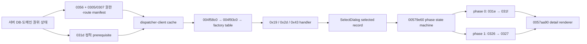

# LOGH VII M4 전략맵 성계 상세 핸드오프

이 문서는 다음 작업자가 전략맵 성계 상세 복원을 즉시 재개하도록 만든 실행 핸드오프다. 전체 부활 로드맵의 완료 문서가 아니다. 현재 위치는 **후반 M3 / 초반 M4의 전략맵 서버-클라이언트 브리지**이며, 전술·전투·소셜·운영은 뒤 단계로 남아 있다.

## 먼저 구분할 상태

| 층 | 상태 | 현재 증거와 남은 일 |
| --- | --- | --- |
| 검토한 기능 코드 기준선 | 푸시 완료 | `implementation_baseline` `b1bf8bc0` |
| 정적·동적 성계 데이터 | 부분 확인 | `0x031d/0x031f/0x0321`, ID `70` 캐시 조인과 lookup 확인. 의미가 고정되지 않은 경제·시설 필드는 보수적으로 비워 둠 |
| `0x0327` 상세 응답 | 구현·테스트·푸시 | `0x0326 → 0x0327` phase 1 계약과 서버 응답 복원 |
| `0x0326` 요청 base 엔디안 | 라이브 관측으로 확정 | `b1bf8bc0`. 원본 클라 요청 body 실바이트에서 base는 오프셋 `0`의 **u32BE**. 서버의 u32LE 판독이 catalog 조인 실패의 원인이었다 |
| generic info 생산 경로 | 정적 RE + 라이브 확인 | factory `0x19`, `0x2d`, `0x43` 경로를 정적으로 확인했고 B71에서 `0x2d` handler `FUN_00582060` 진입을 라이브로 관측 |
| 권한카드 브리지 | 커밋·자동 검증 | `6720faf2`로 커밋됨. B71에서 자연 Captain kind `59` 선택이 실제로 동작함을 확인. 독립 리뷰 후보 4건은 아직 열려 있음 |
| 자연 상세 출력 경로 | **B71 통과** | 원본 UI 조작만으로 `職務権限カード → Captain 59 → 寄港(0x2d) → panel kind 5 → base 70 → phase 0/1 → renderer`가 한 타임라인에서 닫혔다 |
| 화면 상세 필드 렌더 | 미해결 | 배선은 닫혔지만 情報 패널 필드는 여전히 공란이다. `0x0327`이 base ID만 싣고 경제·창고 스칼라를 비워 두는 보수 계약 때문이다 |
| 상세 렌더 표면 정적 RE | 오프셋 확인·의미 미확정 | `FUN_0057aa90`가 창고 캐시(`base+0x3e098c`, 768B)에서 재고·카테고리·스칼라 필드를 읽어 정보패널 뷰 kind `5/0x11`의 情報 슬롯에 그린다. 오프셋은 정본 EXE 실바이트로 확인, 엔디안·tag 게임 의미는 grade-c |
| kind 5/0x11 진입 계기 | 정적 RE로 좁힘 | 뷰 kind는 맵/기지 클릭이 아니라 전략 명령 실행 중 열린다. kind 5 하드코딩 지점은 클래스 `SendOrganizeDataCommand`. factory `0x2d`↔이 클래스 동일 여부와 `0x11` 경로는 grade-c |
| B72 마커 실험 | 보류 | 서버 마커값을 `0x0327`에 실었으나 라이브 검증 실패. 원인은 base-선택 플레이크와 관측 패널 오류(拠点 모달이 아니라 좌상단 정보패널이 렌더 자리) |
| 전체 로드맵 | 진행 중 | 전략 상세 이후 전술·전투·소셜·운영 작업이 남음 |

진척률 백분율은 쓰지 않는다. 위 표의 각 경계는 서로 다른 증거 수준이며, 자동 테스트 통과를 자연 클라이언트 출력 성공으로 대체하지 않는다.

## 기능 코드 기준선과 이미 푸시된 결과

이 문서가 검토한 기능 코드 기준선은 `b1bf8bc0`이다. 다음 커밋 열은 이 기준선까지 포함됐다.

| 커밋 | 고정된 결과 |
| --- | --- |
| `2b630241` | 성계 상세 조회 경로와 ID `70` 조인 복원 |
| `b5c0650c` | 성계 상세 소비 경계 계측 |
| `eade46ad` | 전략 HUD 왼쪽 `職務権限カード`, 오른쪽 `メンバーリスト` 문구·동작 정정 |
| `9aefc9d8` | 당시 성계 상세 RE 현황 문서화 |
| `38c31bd7` | MDX 천체 transform 카탈로그 복원 |
| `83eec2ac` | 전술 위치 wire codec 복원 |
| `df6e032c` | `0x0327` fixed compact phase 1 상세 응답 복원 |
| `1f683df0` | 전략 상세 count/phase 추적의 범위 안전성 정정 |
| `319a1ba9` | route-aware 전략 상세 tracer 복원. 폐기된 factory `0x41` 전제를 제거하고 유효 factory `0x19/0x2d/0x43`을 구분하며 B71 판정 필드를 신설 |
| `b1bf8bc0` | `0x0326` 창고 요청 base를 u32BE로 확정. 실측 요청 바이트를 골든 벡터 테스트로 고정 |

푸시된 결과의 주요 수치는 다음과 같다.

- MDX `418`개 파일, 노드 `3,845`개를 조사했고 transform 카탈로그를 만들었다.
- 전략 성계의 `0x031d/0x031f/0x0321` 캐시와 base `70` lookup을 연결했다.
- 전술 위치 codec은 항성·행성·요새·천체 위치를 담는 `0x033b/0x0345/0x0347/0x0349/0x034b` 계열을 복원했다.
- HUD 두 버튼의 공식 문구와 native mode 전이를 화면에서 확인했다.
- `319a1ba9`가 factory `0x41` 전제를 제거한 route-aware tracer를 넣었고, `b1bf8bc0`이 `0x0326` base 엔디안을 고치며 실측 요청 바이트를 골든 벡터 테스트로 고정했다. 그 결과 서버 전체 테스트는 마커 골든 벡터 테스트를 포함해 `398` 통과다(직전 `396`).

## 웹의 프론트엔드-백엔드로 읽은 native 흐름

원본 클라이언트를 웹 프론트엔드처럼 보면 병목이 분명해진다.

| 웹 개념 | LOGH VII 대응 |
| --- | --- |
| 백엔드 DB·도메인 | 서버가 보유한 캐릭터 권한카드, 성계 정적·동적 상태, 시설 상태 |
| API DTO | `0x0356` 권한카드와 `0x0305/0x0307` command factory 목록, `0x031d/0x031f/0x0327` 상세 데이터 |
| 프론트 store | 클라이언트 dispatcher와 원본/라이브 cache |
| permission/route manifest | `0x0356` 카드 목록과 `0x0305/0x0307` factory ID 배열 |
| router/controller | `FUN_004f58c0 → FUN_004f93c0 → factory table` |
| 선택 view-model | SelectDialog가 만든 selected record. kind `5`는 현재 base 목록, kind `0x11`은 선택 오브젝트 eligibility 목록 |
| component state machine | `FUN_00579e60`의 phase `0/1` 요청·응답 처리 |
| detail renderer | `FUN_0057aa90`, selected record `+8`의 base ID 소비 |



전략맵이 위치와 종류만 보인 B70의 이유는 데이터가 전혀 내려오지 않아서가 아니다. 요약 store와 정적 성계 cache는 채워졌지만 당시 권한 manifest가 자연 detail route를 열지 않았다. `6720faf2`가 서버 권한 manifest를 교정했고, B71이 명령 소유 상세 component의 자연 mount와 phase 요청을 라이브로 증명했다. 남은 병목은 route가 아니라 **응답 payload의 상세 필드**다. 웹으로 옮기면 권한 route와 상세 API 호출은 성공하는데 DTO가 ID만 담고 나머지 필드를 비워 보내는 상태다.

## 정적 RE로 고정된 실제 출력 생산 경로

generic info 생산 경로는 확인됐다.

```text
FUN_004f58c0
→ FUN_004f93c0
→ *(0x00c9e2fc + factoryId * 4)
→ factory handler
→ FUN_00570eb0
→ FUN_00577e70
→ FUN_00579e60
→ FUN_0057aa90
```

native whitelist와 `FUN_00570eb0`의 kind `5/0x11` 생성 경로가 겹치는 factory는 다음 셋이다.

| factory | handler | panel kind | 선택 레코드 원천 | 의미 |
| ---: | --- | ---: | --- | --- |
| `0x19` | `FUN_0058ba40` | `5` | global/current base list | 부대·유닛 편성 계통 |
| `0x2d` | `FUN_00582060` | `5` | global/current base list | `星系グリッド内の惑星間を移動` |
| `0x43` | `FUN_00585150` | `0x11` | selected-object eligibility vector | `割当` |

- kind `5`의 global/current base list stride는 `0x180`이다.
- kind `0x11`의 선택 오브젝트 eligibility vector stride는 `0x24`다.
- 두 경우 모두 renderer가 최종적으로 selected record `+8`의 base ID를 읽는다.
- `0x41`은 kind `5` 생성 지점이 있지만 whitelist에 없으므로 원본에서 비활성인 경로다. 제품 권한으로 부여하지 않는다.

## 상세 패널의 직접 데이터 계약

직접 renderer state machine의 계약은 다음과 같다.

```text
0x031d 정적 성계 캐시: 패널 진입 전 prerequisite
phase 0: 0x031e 요청 → 0x031f 응답
phase 1: 0x0326 요청 → 0x0327 응답
→ FUN_00579e60 kind 5/0x11
→ FUN_0057aa90(selectedRecord + 8 == baseId)
```

`0x0321`은 facility/institution lookup을 위한 병렬 데이터 경로다. 월드 진입에서 `0x031d → 0x031f → 0x0321 → 0x0f03` 순으로 관측됐지만, 이 수신 순서를 `FUN_00579e60`의 직접 renderer prerequisite 체인으로 해석하면 안 된다.

이 계약 전체는 B71에서 라이브로 확인됐다. 다만 `0x0326` 요청의 base는 오프셋 `0`의 **u32BE**다. 이 필드를 u32LE로 읽으면 catalog 조인이 실패해 빈 `0x0327`이 나간다.

## 상세 렌더 표면 — 정적 RE 확정

renderer `FUN_0057aa90`(VA `0x57aa90`)가 실제로 읽는 소비 표면을 정적 RE로 좁혔다. 이 함수는 클라이언트 창고 캐시(`base + 0x3e098c`, 768바이트)에서 필드를 읽어 **전략맵 정보패널 뷰 kind `5`/`0x11`**의 情報 슬롯(slot 0/1/2/10, 드로우 `FUN_00646616 → FUN_0057b7b0`)에 그린다. 즉 상세 데이터가 뜨는 자리는 拠点 모달이 아니라 전략맵 좌상단 정보패널이다.

정본 EXE 실바이트로 검증한 필드 오프셋은 다음과 같다. 값 자체와 엔디안, tag의 게임 의미는 아직 확정하지 못했다(grade-c).

| 오프셋 | 크기·stride | 의미 |
| --- | --- | --- |
| `+0xC` | u8 | 재고 엔트리 수 |
| `+0x10` | stride 6, `+0` u8 | 재고 배열(수량) |
| `+0x260` | u8 | 카테고리 수 |
| `+0x262` | stride 6, `+0` u16 tag, `+4` u16 값 | 카테고리 배열 |
| `+0x2F4` | u32 | 스칼라 |

### kind 5/0x11이 열리는 계기

뷰 kind `5`/`0x11`은 맵이나 기지를 클릭해서가 아니라 **전략 명령 실행 중** 열린다. 뷰 셋업 디스패처 `FUN_00577e70`(VA `0x577e70`)의 직접 호출자는 3곳, 간접 호출자는 0곳이다.

- kind `0` = `0x4f9669`.
- kind 새로고침(`param1=1`, 기존 kind 유지) = `0x579571`.
- 가변 kind(`this->0x28`) = `0x571b10` @ 컨트롤러 `0x571870`. 이 경로는 함수 포인터 테이블 `0x675740[0]`를 경유하며 Ghidra가 인식하지 못한다.

kind `5`를 하드코딩하는 유일 지점은 `0x58be72`의 `mov [esi+0x28],5`이며, 이 지점은 클래스 **SendOrganizeDataCommand**(組織/編成 데이터, 문자열 `0x78c858`)에 속한다. 따라서 kind `5`(基地+駐留艦隊 패널)는 함대 편성류 전략 명령을 실행할 때 열린다. B71의 `寄港`도 같은 명령 인프라(베이스 vtable `0x670274`, 생성자군 `0x580000`–`0x58c000`)의 한 인스턴스다. **factory `0x2d`가 `SendOrganizeDataCommand`와 같은 것인지, 그리고 `0x11` 경로가 어떤 명령인지는 grade-c로 미확정이다.**

## B72 마커 실험 — 보류

renderer가 읽는 오프셋에 서버가 구별 가능한 값을 실어 라이브 대응을 확인하려 했으나 보류했다. 서버 QA 게이트 `LOGH_QA_WAREHOUSE_MARKER=1`(`warehouse-record.mjs`, 게이트 뒤 격리·테스트, **미커밋**)로 `0x0327`에 구별값(재고 합 `66`, 카테고리 tag `0x10=100`·`0x11=200`, 스칼라 `1234`)을 실었지만 라이브 검증은 실패했다. 원인은 둘이다.

1. **base 선택 플레이크.** B72 5회 시도에서 카메라가 세션마다 이동해 고정 좌표로 별·기지를 맞추지 못했다. `ヴァルハラ` 별 위치가 run1 `(418,388)`, run2 `(595,385)`, run3 `(505,388)`으로 매번 달랐다.
2. **관측 패널 오류.** 拠点 모달의 情報 칸을 봤지만, 창고 상세는 그 모달이 아니라 전략맵 좌상단 정보패널에 렌더된다. run8 완전 통과에서도 모달의 情報 칸이 공란이었던 것이 그 증거다. 모달은 renderer를 mount하지 않으며, 실제 렌더 자리인 정보패널이거나 base `70`의 실제 창고가 비어 있어 화면상 `0`이다.

情報 슬롯(`FUN_0057b7b0`)은 월드·전략 로드 시점에만 발화한다(slots 0,1,2,10). 로드 후의 맵·버튼 클릭에는 발화하지 않는다.

## B70의 정확한 판정

증거 디렉터리: [`.omo/live-qa/m3-system-output-B70-natural-20260713`](../.omo/live-qa/m3-system-output-B70-natural-20260713/)

확인한 것:

- 로그인, 월드 진입, 정적·동적 cache join과 클라이언트 생존.
- `0x031d/0x031f/0x0321/0x0f03` 수신·dispatcher 진입.
- base ID `70` lookup.

확인하지 못한 것:

- generic info handler와 kind `5/0x11` 생성.
- `FUN_00579e60` phase 전이, `FUN_0057aa90` render.
- `0x0326` 요청과 `0x0327` 응답.

B70의 panel/render `0`과 `0x0327` `0`은 권한 있는 phase 1이 시작되지 않았기 때문이다. 당시 verdict의 `factory41Granted`와 이를 첫 누락으로 본 판정은 폐기한다. `0x41`은 whitelist 밖이다. 또한 옛 parser가 runtime outer count `2`를 넘겨 읽어 garbage category `15`, raw count `229`를 만들었으므로 그 값도 증거로 쓰지 않는다. 이 over-read는 `1f683df0`에서, factory `0x41` 전제는 route-aware tracer 커밋 `319a1ba9`에서 각각 고쳤다.

역사 참고만 필요한 이전 증거는 B63과 B68b다.

- [B63](../.omo/live-qa/m3-system-detail-B63-wire-cache-join-20260713/)은 서버→wire→cache 결합을 닫았다.
- [B68b](../.omo/live-qa/m3-system-detail-B68b-spot-resolver-row-20260713/)는 `unit[0]+0x40=70`과 lookup을 확인하고, `(158,456)` 행을 성계 행이 아닌 C002 직무카드·유닛 행으로 재분류했다.

## 현재 제품 병목

권한 route와 요청 엔디안 병목은 모두 닫혔다. `6720faf2`가 Captain kind `59/195` 권한 manifest를 교정했고, `b1bf8bc0`이 `0x0326` 요청 base를 u32BE로 확정해 서버가 base `70`을 정확히 조인하게 했다. B71이 이 둘의 결과를 자연 UI 조작만으로 라이브 확인했다.

**남은 병목은 상세 필드 자체다.** 서버 `0x0327`은 base ID만 싣고 경제·창고 스칼라를 `0`/empty로 둔다. 의미가 확정되지 않은 값을 지어내지 않는다는 기존 보수 계약을 지킨 결과이며, 그래서 배선이 끝까지 닿아도 화면의 情報 패널 필드는 공란이다. renderer가 읽는 오프셋 자체는 정적 RE로 확인됐으므로(위 「상세 렌더 표면 — 정적 RE 확정」), 남은 일은 세 갈래다.

1. **정밀 프로브로 kind 경로와 factory 정체를 라이브 확정한다(grade-c → a).** `FUN_00577e70` 진입을 함수 경계 훅으로 잡아 `param_1`과 복귀 주소를 로깅해, 어느 전략 명령이 kind `5`/`0x11`을 발화하는지, factory `0x2d`가 `SendOrganizeDataCommand`와 같은지 확인한다.
2. **마커를 올바른 패널에서 재검증한다.** B71 `寄港` → base `70` 경로를 마커 ON으로 재현하되 拠点 모달이 아니라 전략맵 좌상단 정보패널을 관측해 `66/100/200/1234`로 엔디안과 tag 의미를 확정한다.
3. **정본 창고·경제 데이터를 결합한다.** 오프셋과 의미가 확정된 뒤에만 정본 provenance로 실데이터를 채운다. 확정 전에는 payload를 넓히지 않는다.

정적 RE와 공식 카드 의미로 고정한 최소 canonical grant는 다음과 같다.

| 카드 kind | 명령 |
| ---: | --- |
| personal `0` | 없음 |
| 제국 일반 Captain `59` | `[0x2b, 0x2d]` |
| 동맹 일반 Captain `195` | `[0x2b, 0x2d]` |

반란 진영 kind `123/257`은 camp 증거 없이 자동 부여하지 않는다. `0x41`과 `0x43`도 canonical 기본 grant에서 제외한다.

## `6720faf2`로 커밋된 권한카드 브리지

커밋 `6720faf2`의 16개 파일에는 다음 구현이 들어 있다.

- 단일 authority-card 도메인 계약.
- SQLite와 JSON 저장·legacy backfill.
- `0x0356`의 정확한 `{kind, spot}` 카드 entry.
- 세션과 월드 진입으로의 권한카드 전파.
- `0x0305/0x0307`을 kind `0..maxKind`까지 padding.
- personal kind `0`은 빈 명령, 일반 Captain kind `59/195`는 `[0x2b,0x2d]`.
- 공식 매뉴얼의 `統合作戦本部第三次長` 배치 권한을 OOOO로 정정.

독립 자동 검증 결과는 집중 테스트 `128/128`, 전체 `npm test` `393/393`, `git diff --check` 통과, placeholder scan 이상 없음이다. 이 결과는 **커밋 `6720faf2`의 자동 검증**이며 B71 자연 출력 증거가 아니다.

독립 감사에서 다음 항목은 리뷰·수정 후보로 남았다. 의미 선택이 필요한 항목은 확정 버그로 단정하지 않는다.

- 명시적인 `authorityCards: []`는 빈 배열로 남는다. empty가 의도적 revoke인지 seed 요청인지 계약 결정을 확인해야 한다.
- DB backfill과 delete→insert 교체가 transaction으로 감싸져 있지 않다.
- grant/revoke application command 또는 dirty API가 없다.
- 테스트 한 곳의 이름이 권한카드 수를 `seat count`라고 부른다.

## B71 — 자연 출력 경로 통과

증거 디렉터리: [`.omo/live-qa/m3-system-output-B71-captain-0x2d-natural-20260713-run8/`](../.omo/live-qa/m3-system-output-B71-captain-0x2d-natural-20260713-run8/)

`b71-verdict.json`의 `pass`는 `true`이며 9개 관문이 모두 섰다.

| 관문 | 결과 |
| --- | --- |
| `factory2dGranted` | true |
| `factory2dSelected` | true |
| `handler2dEntered` | true — `FUN_00582060` |
| `panelKind5` | true |
| `selectedBaseId` | `70` |
| `phase0Seen` | true — `0x031e → 0x031f` |
| `phase1Seen` | true — `0x0326 → 0x0327` |
| `rendererCalled` | true — `FUN_0057aa90` |
| 클라이언트 생존 | true |

QA command injection은 쓰지 않았다. 자연 UI 조작만으로 통과했다.

```text
職務権限カード 클릭 (HUD mode 1 → 2)
→ 제국 일반 Captain kind 59 카드 선택
→ 명령 버튼 두 개 중 寄港 = factory 0x2d 클릭
→ 拠点 SelectDialog (panel kind 5)
→ base 70(ヴァルハラ) 행 선택
```

`決定`(이동 확정)은 누르지 않았다. 클라이언트 창고 캐시 `0x3e098c`의 `warehouseBaseId`는 스냅샷 `20/20`에서 `70`이었고, 서버 트레이스의 `selectedBaseId`도 `70`, 응답 body 첫 4바이트는 `00000046`이었다. 정리 뒤 G7 프로세스는 `0`개, TCP `47900` listener도 `0`개였다.

`factory41Observations`는 grant·selected·handler 모두 `false`다. 폐기된 `0x41` 전제를 되살릴 근거는 없다.

### B71이 증명한 것과 증명하지 않은 것

B71은 **경로와 계약의 자연 출력 증명**이다. 상세 데이터 렌더 완료가 아니다. 화면의 情報 패널 필드는 여전히 공란이며([`shots/06c-base-row-after.png`](../.omo/live-qa/m3-system-output-B71-captain-0x2d-natural-20260713-run8/shots/06c-base-row-after.png)), 이는 위 「현재 제품 병목」의 보수 계약 때문이다. 자연 출력 성공과 상세 필드 렌더를 같은 항목으로 합치지 않는다.

QA 하네스에서 발견해 교정한 함정 세 가지 — 카드 행 역순, 명령 버튼 역순(`ワープ航行`이 `0x2b`), 카드 로딩 레이스 — 는 하네스 이슈이며 제품 병목이 아니다.

### 해소된 `0x0326` 요청 base 엔디안

`b1bf8bc0`이 고친 병목이다. 원본 클라이언트 요청 body의 실바이트는 `reqBodyHex = 0000004600000000`(8바이트)이고, base는 오프셋 `0`의 **u32BE**(`0x46` = `70`)다. `0030-decoded`가 보고하는 `innerLen: 10`은 inner 전체, 즉 코드 2바이트에 body 8바이트를 더한 값이다.

서버가 이 필드를 u32LE로 읽어 `1174405120`을 얻었고, 그 값으로는 catalog 조인이 실패해 base `0`인 빈 `0x0327`을 돌려보냈다. 그래서 클라이언트 창고 캐시가 `0`이 되고 상세 패널이 공란이었다. run7이 해석 후보 다섯 가지를 노출했고 BE 판독만 조인에 성공해 관측으로 확정했다. 실측 바이트는 골든 벡터 테스트로 고정했다.

## 다음 작업자의 재개 순서

1. `git status --short --branch`로 현재 브랜치·공유 작업트리와 `implementation_baseline` `0b1430d1`을 대조한다. unrelated generated audit와 config 변경은 건드리지 않는다.
2. `FUN_00577e70` 진입(모듈 베이스 + RVA `0x177e70`)에 함수 경계 훅을 붙여 `param_1`(`[esp+4]`)과 복귀 주소(`[esp]`)를 로깅한다. 복귀가 `0x571b15`면 가변 kind 경로이고 `param_1`이 `5`/`0x11`인지 확인한다. 보강으로 `0x171870` 진입 훅에서 `[ecx+0x28]`(열릴 kind 사전 캡처)을 로깅한다. mid-function 인라인 훅은 금지한다.
3. 훅을 켠 채 전략 명령 메뉴(편성·`寄港` 등)를 순차 조작해 어느 명령이 kind `5`/`0x11`을 발화하는지와 factory `0x2d` 동일 여부를 라이브로 확정한다(grade-c → a).
4. 마커를 재검증한다. B71 `寄港` → base `70` 경로를 마커 ON으로 재현하되 拠点 모달이 아니라 전략맵 좌상단 정보패널을 관측해 `66/100/200/1234`로 엔디안·tag 의미를 확정한다. 재사용 가능한 프로브는 `tools/live/_frida_baseinfo_probe.js`, `tools/live/_baseinfo_discovery.py`다.
5. 확정 뒤에만 정본 창고·경제 데이터(로드맵 wave-3 todo 20)를 renderer가 읽는 오프셋에 결합한다. 결합할 정본이 없는 값은 만들어 내지 않는다. 공식 매뉴얼과 2004 공식 패치 로그가 게임 규칙의 근거다.
6. 열려 있는 리뷰 후보 4건(`authorityCards: []` 계약, DB backfill transaction, grant/revoke API, `seat count` 테스트 명칭)을 처리한다.
7. 변경 뒤 집중 테스트와 전체 `npm test`, diff-check, placeholder scan을 다시 실행한다.
8. 상세 필드가 실제로 화면에 뜨는지 B71과 같은 자연 경로로, 拠点 모달이 아니라 전략맵 좌상단 정보패널을 관측해 다시 라이브 검증한다. 자동 테스트 통과를 화면 출력 증거로 대체하지 않는다.
9. discovery 드라이버의 strategy-ready 게이트(`hudModeF4 in 1,2`)가 "NOW LOADING" 중에도 통과할 수 있는 하네스 결함을 실제 맵 렌더 대기로 강화한다. RE와 무관한 하네스 이슈다.
10. 서버 데이터, tracer, 문서 변경을 서로 섞지 말고 정확한 파일만 stage해 원자적으로 커밋·푸시한다.

## 2026-07-14 세션 갱신

이번 세션(2026-07-14)에 다음 6개 커밋이 추가됐다.

| 커밋 | 내용 |
| --- | --- |
| `12a1e78f` | 라이브QA 하네스 fail-closed 게이트 + 경제 미구현 정본 판정 |
| `2bec898e` | 권한카드 seed/revoke 계약·트랜잭션·grant/revoke API |
| `9ba3be12` | 0x0327 창고 QA 마커 게이트 |
| `426691b6` | 로비→월드 진입 회귀 수정 + 토스트 occlusion 가드 (월드 진입 라이브 통과) |
| `74be8481` | 拠点 SelectDialog 행 좌표 RE |
| `2112abcd` | 拠点 행 좌표 캡처 프로브 |

**핵심 판정 변경 3건:**

**(1) 경제 필드 공란은 병목이 아니라 정본 동작이다.** 공식 매뉴얼 p9가 `経済関連は現在未実装`을 명시한다. MsgDat 9,582 레코드·EXE 정적 테이블에 경제 수치 0건. 따라서 情報 패널의 경제 스칼라(세수·인구·GNP·산업) 공란은 원본에 부합하는 정답이며, 절차생성 값으로 채우면 원본에 없던 콘텐츠를 지어내는 것이다. 채울 대상은 경제가 아니라 **보급 물자·시설·요새**(전부 정본 원천 있음). 상세 판정: `docs/logh7-economy-unimplemented-canon-verdict-2026-07-14.md`. 로드맵의 "0x0327 빈 경제 스칼라"는 **열린 병목에서 닫힌 항목으로 재분류**한다.

**(2) 拠点 SelectDialog 행 화면 rect는 메모리에 저장되지 않는다.** 정적 RE(정본 EXE sha256 9c97…bb51 실바이트 검증)로 확정: 리스트 위젯(parent+0x244)과 그리드(list+0x20)는 논리 모델(std::list, baseId=node+0x10)만 들고, 픽셀 좌표는 입력/렌더 엔진 FUN_005015f0(0x5015f0)이 draw/hit-test 시점에 전역 상태로부터 계산한다. list ctor FUN_004fa350(file 0xfa350)의 상수 5000/25는 행 높이가 아니라 ctor 리터럴이다. 상세 RE: `docs/logh7-spot-select-dialog-row-re-2026-07-14.md`.

**(3) 현재 병목은 좌측 목적지 목록 행의 자연 클릭 좌표다.** 라이브 B80에서 확정: 경로 A(FUN_005015f0 param_1==0xe && param_2==grid)가 짚는 위젯은 좌측 목록이 아니라 **우측 情報 상세 grid**다(캡처 x=821,y=280). 좌측 목적지 행은 0xe 경로를 아예 타지 않는다. 경로 B(FUN_00576d40 인덱스 직접 선택, LOGH_B71_PATH_B 게이트 뒤)는 list+0x8e8 하이라이트만 세팅하고 parent+0xb2c(infoSelectedIndex)를 갱신하지 않아 0x031e를 발행하지 않는다 — 불완전한 선택이라 자연 클릭을 대체 못 한다. **주의: B80이 "寄港 다이얼로그 情報=최저 조건이라 창고 아님"이라고 전제 불일치를 의심했으나, 이는 경로 B가 불완전해서 생긴 red herring이다.** B71 run8이 좌측 행 자연 클릭으로 phase0(031e→031f)·phase1(0326→0327)·renderer(FUN_0057aa90)를 실제로 발화시키고 warehouseBaseId=70을 만들었다(verdict pass=true). 따라서 寄港→base 70→창고 상세 전제는 유효하다. 다음 프로브는 좌측 목록 행이 실제로 타는 hit-test/draw 경로를 찾아 그 좌표를 라이브 캡처하는 것이다.

**해결된 것:**
- 열린 리뷰 후보 4건 전부 닫힘(권한카드 커밋 `2bec898e`). 서버 테스트 434 통과.
- 하네스 strategy-ready 게이트(재개순서 9번)는 실제 렌더 대기로 강화됨(커밋 `426691b6`).
- 재개순서 6·9번 완료.

**미해결로 넘기는 것:**
- 재개순서 5번(정본 창고·시설·요새 데이터 결합)은 (3)의 좌측 행 좌표 병목이 풀린 뒤, 마커로 엔디안·tag를 확정한 뒤에만. 경제는 (1)에 따라 결합 대상에서 제외.
- 재개순서 8번(상세 필드 화면 렌더 자연 검증)은 (3) 미해결로 여전히 열림.

**이번 세션에서 유발하고 고친 회귀(정직 기록):** 하네스 fail-closed 게이트 커밋(`12a1e78f`)이 char-card 클릭 전 load-bearing 대기를 "근거 없는 sleep"으로 오판해 제거, 로비→월드 진입이 깨졌다. B74 타임라인(login-ok→0x2003 약 11초)을 근거로 복원했고 근거를 주석에 못 박았다(커밋 `426691b6`). 별개로 한 워커가 git reset --hard로 미커밋 작업을 파괴(권한카드·마커 재구성해 복구, `.codex/config.toml` 사용자 변경은 미복구), 다른 워커가 사용자 Windows ForegroundLockTimeout을 무단 변경(기본값 복구). 라이브 QA 중 클라 클릭을 가리는 Windows 알림 토스트가 구조적 충돌(로그인 시 1024x768 전환으로 토스트 도킹 영역이 캐릭터 카드와 겹침)임을 확인, 토스트만 정상 dismiss하는 가드를 넣었다(커밋 `426691b6`).

## 관련 문서와 증거

- [[logh7-strategy-system-detail-current|현재 전략맵 성계 상세 복원]]
- [[logh7-document-index-current|현재 문서 인덱스]]
- [[logh7-m3-join-handoff-2026-07-11|M3 역사 핸드오프]] — 수정하지 않은 역사 기록
- [B71 자연 출력 통과 런](../.omo/live-qa/m3-system-output-B71-captain-0x2d-natural-20260713-run8/)
- [B70 자연 런](../.omo/live-qa/m3-system-output-B70-natural-20260713/)
- [B63 wire/cache 런](../.omo/live-qa/m3-system-detail-B63-wire-cache-join-20260713/)
- [B68b lookup/C002 정정 런](../.omo/live-qa/m3-system-detail-B68b-spot-resolver-row-20260713/)
- [`server/src/domain/authority-cards.mjs`](../server/src/domain/authority-cards.mjs)
- [`server/src/server/logh7-world-session.mjs`](../server/src/server/logh7-world-session.mjs)
- [`tools/live/_frida_strategy_snapshot.js`](../tools/live/_frida_strategy_snapshot.js)
- [`tools/live/_strategy_table_probe.py`](../tools/live/_strategy_table_probe.py)
