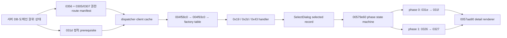

# LOGH VII M4 전략맵 성계 상세 핸드오프

이 문서는 다음 작업자가 전략맵 성계 상세 복원을 즉시 재개하도록 만든 실행 핸드오프다. 전체 부활 로드맵의 완료 문서가 아니다. 현재 위치는 **후반 M3 / 초반 M4의 전략맵 서버-클라이언트 브리지**이며, 전술·전투·소셜·운영은 뒤 단계로 남아 있다.

## 먼저 구분할 상태

| 층 | 상태 | 현재 증거와 남은 일 |
| --- | --- | --- |
| 검토한 기능 코드 기준선 | 푸시 완료 | `implementation_baseline` `1f683df0` |
| 정적·동적 성계 데이터 | 부분 확인 | `0x031d/0x031f/0x0321`, ID `70` 캐시 조인과 lookup 확인. 의미가 고정되지 않은 경제·시설 필드는 보수적으로 비워 둠 |
| `0x0327` 상세 응답 | 구현·테스트·푸시 | `0x0326 → 0x0327` phase 1 계약과 서버 응답 복원 |
| generic info 생산 경로 | 정적 RE 확인 | factory `0x19`, `0x2d`, `0x43`에서 `FUN_00579e60 → FUN_0057aa90`으로 이어지는 경로 확인 |
| 권한카드 브리지 | 커밋·자동 검증 | `6720faf2`로 커밋됨. 집중 `128/128`, 전체 `393/393`, diff-check·placeholder scan 통과. 독립 리뷰 후보와 라이브 B71은 남음 |
| 자연 상세 출력 | 미확인 | B70은 캐시까지 성공했으나 권한 있는 phase 1이 시작되지 않아 panel/render와 `0x0327`이 0 |
| 전체 로드맵 | 진행 중 | 전략 상세 이후 전술·전투·소셜·운영 작업이 남음 |

진척률 백분율은 쓰지 않는다. 위 표의 각 경계는 서로 다른 증거 수준이며, 자동 테스트 통과를 자연 클라이언트 출력 성공으로 대체하지 않는다.

## 기능 코드 기준선과 이미 푸시된 결과

이 문서가 검토한 기능 코드 기준선은 `1f683df0`이다. 다음 커밋 열은 이 기준선까지 포함됐다.

| 커밋 | 고정된 결과 |
| --- | --- |
| `2b630241` | 성계 상세 조회 경로와 ID `70` 조인 복원 |
| `b5c0650c` | 성계 상세 소비 경계 계측 |
| `eade46ad` | 전략 HUD 왼쪽 `職務権限カード`, 오른쪽 `メンバーリスト` 문구·동작 정정 |
| `9aefc9d8` | 당시 성계 상세 RE 현황 문서화 |
| `38c31bd7` | MDX 천체 transform 카탈로그 복원 |
| `83eec2ac` | 전술 위치 wire codec 복원 |
| `df6e032c` | `0x0327` fixed compact phase 1 상세 응답 복원 |
| `1f683df0` | 전략 상세 count/phase 추적의 범위 안전성 정정 |

푸시된 결과의 주요 수치는 다음과 같다.

- MDX `418`개 파일, 노드 `3,845`개를 조사했고 transform 카탈로그를 만들었다.
- 전략 성계의 `0x031d/0x031f/0x0321` 캐시와 base `70` lookup을 연결했다.
- 전술 위치 codec은 항성·행성·요새·천체 위치를 담는 `0x033b/0x0345/0x0347/0x0349/0x034b` 계열을 복원했다.
- HUD 두 버튼의 공식 문구와 native mode 전이를 화면에서 확인했다.
- `1f683df0`은 table count와 phase를 안전하게 추적하지만, **HEAD의 tracer는 아직 factory `0x41`을 전제로 한다. route-aware tracer는 아직 푸시되지 않았다.**

## 웹의 프론트엔드-백엔드로 읽은 native 흐름

원본 클라이언트를 웹 프론트엔드처럼 보면 병목이 분명해진다.

| 웹 개념 | LOGH VII 대응 |
| --- | --- |
| 백엔드 DB·도메인 | 서버가 보유한 캐릭터 권한카드, 성계 정적·동적 상태, 시설 상태 |
| API DTO | `0x0356` 권한카드와 `0x0305/0x0307` command factory 목록, `0x031d/0x031f/0x0327` 상세 데이터 |
| 프론트 store | 클라이언트 dispatcher와 원본/라이브 cache |
| permission/route manifest | `0x0356` 카드 목록과 `0x0305/0x0307` factory ID 배열 |
| router/controller | `FUN_004f58c0 → FUN_004f93c0 → factory table` |
| 선택 view-model | SelectDialog가 만든 selected record. kind `5`는 현재 base 목록, kind `0x11`은 선택 오브젝트 eligibility 목록 |
| component state machine | `FUN_00579e60`의 phase `0/1` 요청·응답 처리 |
| detail renderer | `FUN_0057aa90`, selected record `+8`의 base ID 소비 |



전략맵이 위치와 종류만 보인 B70의 이유는 데이터가 전혀 내려오지 않아서가 아니다. 요약 store와 정적 성계 cache는 채워졌지만 당시 권한 manifest가 자연 detail route를 열지 않았다. `6720faf2`가 서버 권한 manifest를 교정했으며, 명령 소유 상세 component의 자연 mount와 phase 요청은 B71에서 확인해야 한다.

## 정적 RE로 고정된 실제 출력 생산 경로

generic info 생산 경로는 확인됐다.

```text
FUN_004f58c0
→ FUN_004f93c0
→ *(0x00c9e2fc + factoryId * 4)
→ factory handler
→ FUN_00570eb0
→ FUN_00577e70
→ FUN_00579e60
→ FUN_0057aa90
```

native whitelist와 `FUN_00570eb0`의 kind `5/0x11` 생성 경로가 겹치는 factory는 다음 셋이다.

| factory | handler | panel kind | 선택 레코드 원천 | 의미 |
| ---: | --- | ---: | --- | --- |
| `0x19` | `FUN_0058ba40` | `5` | global/current base list | 부대·유닛 편성 계통 |
| `0x2d` | `FUN_00582060` | `5` | global/current base list | `星系グリッド内の惑星間を移動` |
| `0x43` | `FUN_00585150` | `0x11` | selected-object eligibility vector | `割当` |

- kind `5`의 global/current base list stride는 `0x180`이다.
- kind `0x11`의 선택 오브젝트 eligibility vector stride는 `0x24`다.
- 두 경우 모두 renderer가 최종적으로 selected record `+8`의 base ID를 읽는다.
- `0x41`은 kind `5` 생성 지점이 있지만 whitelist에 없으므로 원본에서 비활성인 경로다. 제품 권한으로 부여하지 않는다.

## 상세 패널의 직접 데이터 계약

직접 renderer state machine의 계약은 다음과 같다.

```text
0x031d 정적 성계 캐시: 패널 진입 전 prerequisite
phase 0: 0x031e 요청 → 0x031f 응답
phase 1: 0x0326 요청 → 0x0327 응답
→ FUN_00579e60 kind 5/0x11
→ FUN_0057aa90(selectedRecord + 8 == baseId)
```

`0x0321`은 facility/institution lookup을 위한 병렬 데이터 경로다. 월드 진입에서 `0x031d → 0x031f → 0x0321 → 0x0f03` 순으로 관측됐지만, 이 수신 순서를 `FUN_00579e60`의 직접 renderer prerequisite 체인으로 해석하면 안 된다.

## B70의 정확한 판정

증거 디렉터리: [`.omo/live-qa/m3-system-output-B70-natural-20260713`](../.omo/live-qa/m3-system-output-B70-natural-20260713/)

확인한 것:

- 로그인, 월드 진입, 정적·동적 cache join과 클라이언트 생존.
- `0x031d/0x031f/0x0321/0x0f03` 수신·dispatcher 진입.
- base ID `70` lookup.

확인하지 못한 것:

- generic info handler와 kind `5/0x11` 생성.
- `FUN_00579e60` phase 전이, `FUN_0057aa90` render.
- `0x0326` 요청과 `0x0327` 응답.

B70의 panel/render `0`과 `0x0327` `0`은 권한 있는 phase 1이 시작되지 않았기 때문이다. 당시 verdict의 `factory41Granted`와 이를 첫 누락으로 본 판정은 폐기한다. `0x41`은 whitelist 밖이다. 또한 옛 parser가 runtime outer count `2`를 넘겨 읽어 garbage category `15`, raw count `229`를 만들었으므로 그 값도 증거로 쓰지 않는다. 이 over-read는 `1f683df0`에서 안전하게 고쳤지만, factory `0x41` 전제는 route-aware tracer가 교체해야 한다.

역사 참고만 필요한 이전 증거는 B63과 B68b다.

- [B63](../.omo/live-qa/m3-system-detail-B63-wire-cache-join-20260713/)은 서버→wire→cache 결합을 닫았다.
- [B68b](../.omo/live-qa/m3-system-detail-B68b-spot-resolver-row-20260713/)는 `unit[0]+0x40=70`과 lookup을 확인하고, `(158,456)` 행을 성계 행이 아닌 C002 직무카드·유닛 행으로 재분류했다.

## 현재 제품 병목

`1f683df0` 기준선은 anonymous/personal ordinal에 `0x2b`를 넣고 Captain kind를 만들지 않았다. `6720faf2`가 이 서버 권한 병목을 교정해 커밋했으며, 원본 UI의 자연 factory `0x2d` detail route는 B71 라이브 전이다.

정적 RE와 공식 카드 의미로 고정할 최소 canonical grant는 다음과 같다.

| 카드 kind | 명령 |
| ---: | --- |
| personal `0` | 없음 |
| 제국 일반 Captain `59` | `[0x2b, 0x2d]` |
| 동맹 일반 Captain `195` | `[0x2b, 0x2d]` |

반란 진영 kind `123/257`은 camp 증거 없이 자동 부여하지 않는다. `0x41`과 `0x43`도 canonical 기본 grant에서 제외한다.

## `6720faf2`로 커밋된 권한카드 브리지

커밋 `6720faf2`의 16개 파일에는 다음 구현이 들어 있다.

- 단일 authority-card 도메인 계약.
- SQLite와 JSON 저장·legacy backfill.
- `0x0356`의 정확한 `{kind, spot}` 카드 entry.
- 세션과 월드 진입으로의 권한카드 전파.
- `0x0305/0x0307`을 kind `0..maxKind`까지 padding.
- personal kind `0`은 빈 명령, 일반 Captain kind `59/195`는 `[0x2b,0x2d]`.
- 공식 매뉴얼의 `統合作戦本部第三次長` 배치 권한을 OOOO로 정정.

독립 자동 검증 결과는 집중 테스트 `128/128`, 전체 `npm test` `393/393`, `git diff --check` 통과, placeholder scan 이상 없음이다. 이 결과는 **커밋 `6720faf2`의 자동 검증**이며 B71 자연 출력 증거가 아니다.

독립 감사에서 다음 항목은 리뷰·수정 후보로 남았다. 의미 선택이 필요한 항목은 확정 버그로 단정하지 않는다.

- 명시적인 `authorityCards: []`는 빈 배열로 남는다. empty가 의도적 revoke인지 seed 요청인지 계약 결정을 확인해야 한다.
- DB backfill과 delete→insert 교체가 transaction으로 감싸져 있지 않다.
- grant/revoke application command 또는 dirty API가 없다.
- 테스트 한 곳의 이름이 권한카드 수를 `seat count`라고 부른다.

## B71 자연 라이브 통과 조건

권장 증거 디렉터리 이름:

```text
.omo/live-qa/m3-system-output-B71-captain-0x2d-natural-20260713
```

B71 전제:

1. 커밋 `6720faf2`의 diff와 위 감사 후보를 검토한다.
2. HEAD의 factory `0x41` 전제를 제거한 route-aware tracer를 준비한다.
3. 자연 UI에서 제국 Captain kind `59`를 선택할 수 있게 한다.

B71 절차와 통과 기준:

- QA command injection 없이 실행한다.
- `職務権限カード`에서 Captain kind `59`를 자연 선택한다.
- factory `0x2d` 행을 누르되 실제 이동 확인은 누르지 않는다.
- `0x0305/0x0307`이 category `0..59`, 총 `60`개 행을 만들고 kind `59`에 `[0x2b,0x2d]`가 있어야 한다.
- handler `FUN_00582060`, panel kind `5`, selected row `+8=70`을 잡아야 한다.
- phase 0 `0x031e → 0x031f`, phase 1 `0x0326 → 0x0327`을 같은 타임라인에서 확인해야 한다.
- `FUN_00579e60`과 `FUN_0057aa90` 호출, base `70` 소비를 확인해야 한다.
- 클라이언트가 끝까지 생존하고 정리 뒤 G7/Gin7 프로세스와 TCP `47900` listener가 모두 없어야 한다.

자연 경로가 실패할 때만 B72를 별도 증거로 실행한다. B72는 **명시적 QA-only factory `0x2d` injection positive control**이며 B71 자연 성공으로 합치지 않는다. B72가 성공하면 서버 상세 데이터와 renderer는 살아 있고 권한카드/선택 route가 남은 병목이라는 뜻이다.

## 다음 작업자의 재개 순서

1. `git status --short --branch`로 현재 브랜치·공유 작업트리와 `implementation_baseline` `1f683df0`을 대조한다. unrelated generated audit와 config 변경은 건드리지 않는다.
2. 커밋 `6720faf2`의 diff와 위 네 감사 후보의 계약을 검토한다.
3. route-aware tracer가 `0x19/0x2d/0x43`을 구분하고 `0x41`을 필수 조건으로 삼지 않는지 검토한다.
4. 변경 뒤 집중 테스트와 전체 `npm test`, diff-check, placeholder scan을 다시 실행한다.
5. QA injection 없이 B71을 실행해 Captain `59 → 0x2d → kind 5 → base 70 → 031f/0327 → 0057aa90`을 한 타임라인으로 증명한다.
6. 자연 경로가 실패하면 최초 누락 경계를 기준으로 수정한다. B72는 renderer positive control이 필요할 때만 별도 실행한다.
7. 라이브 결과를 [[logh7-strategy-system-detail-current|현재 전략 성계 상세 문서]]와 이 핸드오프, Obsidian 독립 노트에 반영한다.
8. 서버 권한 브리지, tracer, 문서 변경을 서로 섞지 말고 정확한 파일만 stage해 원자적으로 커밋·푸시한다.

## 관련 문서와 증거

- [[logh7-strategy-system-detail-current|현재 전략맵 성계 상세 복원]]
- [[logh7-document-index-current|현재 문서 인덱스]]
- [[logh7-m3-join-handoff-2026-07-11|M3 역사 핸드오프]] — 수정하지 않은 역사 기록
- [B70 자연 런](../.omo/live-qa/m3-system-output-B70-natural-20260713/)
- [B63 wire/cache 런](../.omo/live-qa/m3-system-detail-B63-wire-cache-join-20260713/)
- [B68b lookup/C002 정정 런](../.omo/live-qa/m3-system-detail-B68b-spot-resolver-row-20260713/)
- [`server/src/domain/authority-cards.mjs`](../server/src/domain/authority-cards.mjs)
- [`server/src/server/logh7-world-session.mjs`](../server/src/server/logh7-world-session.mjs)
- [`tools/live/_frida_strategy_snapshot.js`](../tools/live/_frida_strategy_snapshot.js)
- [`tools/live/_strategy_table_probe.py`](../tools/live/_strategy_table_probe.py)
