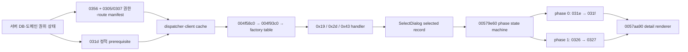

# LOGH VII M4 전략맵 성계 상세 핸드오프

이 문서는 다음 작업자가 전략맵 성계 상세 복원을 즉시 재개하도록 만든 실행 핸드오프다. 전체 부활 로드맵의 완료 문서가 아니다. 현재 위치는 **후반 M3 / 초반 M4의 전략맵 서버-클라이언트 브리지**이며, 전술·전투·소셜·운영은 뒤 단계로 남아 있다.

## 먼저 구분할 상태

| 층 | 상태 | 현재 증거와 남은 일 |
| --- | --- | --- |
| 검토한 기능 코드 기준선 | 푸시 완료 | `implementation_baseline` `b1bf8bc0` |
| 정적·동적 성계 데이터 | 부분 확인 | `0x031d/0x031f/0x0321`, ID `70` 캐시 조인과 lookup 확인. 의미가 고정되지 않은 경제·시설 필드는 보수적으로 비워 둠 |
| `0x0327` 상세 응답 | 구현·테스트·푸시 | `0x0326 → 0x0327` phase 1 계약과 서버 응답 복원 |
| `0x0326` 요청 base 엔디안 | 라이브 관측으로 확정 | `b1bf8bc0`. 원본 클라 요청 body 실바이트에서 base는 오프셋 `0`의 **u32BE**. 서버의 u32LE 판독이 catalog 조인 실패의 원인이었다 |
| generic info 생산 경로 | 정적 RE + 라이브 확인 | factory `0x19`, `0x2d`, `0x43` 경로를 정적으로 확인했고 B71에서 `0x2d` handler `FUN_00582060` 진입을 라이브로 관측 |
| 권한카드 브리지 | 커밋·자동 검증 | `6720faf2`로 커밋됨. B71에서 자연 Captain kind `59` 선택이 실제로 동작함을 확인. 독립 리뷰 후보 4건은 아직 열려 있음 |
| 자연 상세 출력 경로 | **B71 통과** | 원본 UI 조작만으로 `職務権限カード → Captain 59 → 寄港(0x2d) → panel kind 5 → base 70 → phase 0/1 → renderer`가 한 타임라인에서 닫혔다 |
| 화면 상세 필드 렌더 | 미해결 | 배선은 닫혔지만 情報 패널 필드는 여전히 공란이다. `0x0327`이 base ID만 싣고 경제·창고 스칼라를 비워 두는 보수 계약 때문이다 |
| 전체 로드맵 | 진행 중 | 전략 상세 이후 전술·전투·소셜·운영 작업이 남음 |

진척률 백분율은 쓰지 않는다. 위 표의 각 경계는 서로 다른 증거 수준이며, 자동 테스트 통과를 자연 클라이언트 출력 성공으로 대체하지 않는다.

## 기능 코드 기준선과 이미 푸시된 결과

이 문서가 검토한 기능 코드 기준선은 `b1bf8bc0`이다. 다음 커밋 열은 이 기준선까지 포함됐다.

| 커밋 | 고정된 결과 |
| --- | --- |
| `2b630241` | 성계 상세 조회 경로와 ID `70` 조인 복원 |
| `b5c0650c` | 성계 상세 소비 경계 계측 |
| `eade46ad` | 전략 HUD 왼쪽 `職務権限カード`, 오른쪽 `メンバーリスト` 문구·동작 정정 |
| `9aefc9d8` | 당시 성계 상세 RE 현황 문서화 |
| `38c31bd7` | MDX 천체 transform 카탈로그 복원 |
| `83eec2ac` | 전술 위치 wire codec 복원 |
| `df6e032c` | `0x0327` fixed compact phase 1 상세 응답 복원 |
| `1f683df0` | 전략 상세 count/phase 추적의 범위 안전성 정정 |
| `319a1ba9` | route-aware 전략 상세 tracer 복원. 폐기된 factory `0x41` 전제를 제거하고 유효 factory `0x19/0x2d/0x43`을 구분하며 B71 판정 필드를 신설 |
| `b1bf8bc0` | `0x0326` 창고 요청 base를 u32BE로 확정. 실측 요청 바이트를 골든 벡터 테스트로 고정 |

푸시된 결과의 주요 수치는 다음과 같다.

- MDX `418`개 파일, 노드 `3,845`개를 조사했고 transform 카탈로그를 만들었다.
- 전략 성계의 `0x031d/0x031f/0x0321` 캐시와 base `70` lookup을 연결했다.
- 전술 위치 codec은 항성·행성·요새·천체 위치를 담는 `0x033b/0x0345/0x0347/0x0349/0x034b` 계열을 복원했다.
- HUD 두 버튼의 공식 문구와 native mode 전이를 화면에서 확인했다.
- `319a1ba9`가 factory `0x41` 전제를 제거한 route-aware tracer를 넣었고, `b1bf8bc0`이 `0x0326` base 엔디안을 고쳤다. 두 커밋 뒤 전체 테스트는 `396/396` 통과다.

## 웹의 프론트엔드-백엔드로 읽은 native 흐름

원본 클라이언트를 웹 프론트엔드처럼 보면 병목이 분명해진다.

| 웹 개념 | LOGH VII 대응 |
| --- | --- |
| 백엔드 DB·도메인 | 서버가 보유한 캐릭터 권한카드, 성계 정적·동적 상태, 시설 상태 |
| API DTO | `0x0356` 권한카드와 `0x0305/0x0307` command factory 목록, `0x031d/0x031f/0x0327` 상세 데이터 |
| 프론트 store | 클라이언트 dispatcher와 원본/라이브 cache |
| permission/route manifest | `0x0356` 카드 목록과 `0x0305/0x0307` factory ID 배열 |
| router/controller | `FUN_004f58c0 → FUN_004f93c0 → factory table` |
| 선택 view-model | SelectDialog가 만든 selected record. kind `5`는 현재 base 목록, kind `0x11`은 선택 오브젝트 eligibility 목록 |
| component state machine | `FUN_00579e60`의 phase `0/1` 요청·응답 처리 |
| detail renderer | `FUN_0057aa90`, selected record `+8`의 base ID 소비 |



전략맵이 위치와 종류만 보인 B70의 이유는 데이터가 전혀 내려오지 않아서가 아니다. 요약 store와 정적 성계 cache는 채워졌지만 당시 권한 manifest가 자연 detail route를 열지 않았다. `6720faf2`가 서버 권한 manifest를 교정했고, B71이 명령 소유 상세 component의 자연 mount와 phase 요청을 라이브로 증명했다. 남은 병목은 route가 아니라 **응답 payload의 상세 필드**다. 웹으로 옮기면 권한 route와 상세 API 호출은 성공하는데 DTO가 ID만 담고 나머지 필드를 비워 보내는 상태다.

## 정적 RE로 고정된 실제 출력 생산 경로

generic info 생산 경로는 확인됐다.

```text
FUN_004f58c0
→ FUN_004f93c0
→ *(0x00c9e2fc + factoryId * 4)
→ factory handler
→ FUN_00570eb0
→ FUN_00577e70
→ FUN_00579e60
→ FUN_0057aa90
```

native whitelist와 `FUN_00570eb0`의 kind `5/0x11` 생성 경로가 겹치는 factory는 다음 셋이다.

| factory | handler | panel kind | 선택 레코드 원천 | 의미 |
| ---: | --- | ---: | --- | --- |
| `0x19` | `FUN_0058ba40` | `5` | global/current base list | 부대·유닛 편성 계통 |
| `0x2d` | `FUN_00582060` | `5` | global/current base list | `星系グリッド内の惑星間を移動` |
| `0x43` | `FUN_00585150` | `0x11` | selected-object eligibility vector | `割当` |

- kind `5`의 global/current base list stride는 `0x180`이다.
- kind `0x11`의 선택 오브젝트 eligibility vector stride는 `0x24`다.
- 두 경우 모두 renderer가 최종적으로 selected record `+8`의 base ID를 읽는다.
- `0x41`은 kind `5` 생성 지점이 있지만 whitelist에 없으므로 원본에서 비활성인 경로다. 제품 권한으로 부여하지 않는다.

## 상세 패널의 직접 데이터 계약

직접 renderer state machine의 계약은 다음과 같다.

```text
0x031d 정적 성계 캐시: 패널 진입 전 prerequisite
phase 0: 0x031e 요청 → 0x031f 응답
phase 1: 0x0326 요청 → 0x0327 응답
→ FUN_00579e60 kind 5/0x11
→ FUN_0057aa90(selectedRecord + 8 == baseId)
```

`0x0321`은 facility/institution lookup을 위한 병렬 데이터 경로다. 월드 진입에서 `0x031d → 0x031f → 0x0321 → 0x0f03` 순으로 관측됐지만, 이 수신 순서를 `FUN_00579e60`의 직접 renderer prerequisite 체인으로 해석하면 안 된다.

이 계약 전체는 B71에서 라이브로 확인됐다. 다만 `0x0326` 요청의 base는 오프셋 `0`의 **u32BE**다. 이 필드를 u32LE로 읽으면 catalog 조인이 실패해 빈 `0x0327`이 나간다.

## B70의 정확한 판정

증거 디렉터리: [`.omo/live-qa/m3-system-output-B70-natural-20260713`](../.omo/live-qa/m3-system-output-B70-natural-20260713/)

확인한 것:

- 로그인, 월드 진입, 정적·동적 cache join과 클라이언트 생존.
- `0x031d/0x031f/0x0321/0x0f03` 수신·dispatcher 진입.
- base ID `70` lookup.

확인하지 못한 것:

- generic info handler와 kind `5/0x11` 생성.
- `FUN_00579e60` phase 전이, `FUN_0057aa90` render.
- `0x0326` 요청과 `0x0327` 응답.

B70의 panel/render `0`과 `0x0327` `0`은 권한 있는 phase 1이 시작되지 않았기 때문이다. 당시 verdict의 `factory41Granted`와 이를 첫 누락으로 본 판정은 폐기한다. `0x41`은 whitelist 밖이다. 또한 옛 parser가 runtime outer count `2`를 넘겨 읽어 garbage category `15`, raw count `229`를 만들었으므로 그 값도 증거로 쓰지 않는다. 이 over-read는 `1f683df0`에서, factory `0x41` 전제는 route-aware tracer 커밋 `319a1ba9`에서 각각 고쳤다.

역사 참고만 필요한 이전 증거는 B63과 B68b다.

- [B63](../.omo/live-qa/m3-system-detail-B63-wire-cache-join-20260713/)은 서버→wire→cache 결합을 닫았다.
- [B68b](../.omo/live-qa/m3-system-detail-B68b-spot-resolver-row-20260713/)는 `unit[0]+0x40=70`과 lookup을 확인하고, `(158,456)` 행을 성계 행이 아닌 C002 직무카드·유닛 행으로 재분류했다.

## 현재 제품 병목

권한 route와 요청 엔디안 병목은 모두 닫혔다. `6720faf2`가 Captain kind `59/195` 권한 manifest를 교정했고, `b1bf8bc0`이 `0x0326` 요청 base를 u32BE로 확정해 서버가 base `70`을 정확히 조인하게 했다. B71이 이 둘의 결과를 자연 UI 조작만으로 라이브 확인했다.

**남은 병목은 상세 필드 자체다.** 서버 `0x0327`은 base ID만 싣고 경제·창고 스칼라를 `0`/empty로 둔다. 의미가 확정되지 않은 값을 지어내지 않는다는 기존 보수 계약을 지킨 결과이며, 그래서 배선이 끝까지 닿아도 화면의 情報 패널 필드는 공란이다. 다음 작업은 두 단계다.

1. `FUN_0057aa90`이 실제로 읽는 상세 필드 오프셋을 라이브로 고정한다.
2. 고정된 오프셋에만 `0x031f`/`0x0321`/`0x0327`의 경제·시설 스칼라를 정본 데이터와 결합한다.

정적 RE와 공식 카드 의미로 고정한 최소 canonical grant는 다음과 같다.

| 카드 kind | 명령 |
| ---: | --- |
| personal `0` | 없음 |
| 제국 일반 Captain `59` | `[0x2b, 0x2d]` |
| 동맹 일반 Captain `195` | `[0x2b, 0x2d]` |

반란 진영 kind `123/257`은 camp 증거 없이 자동 부여하지 않는다. `0x41`과 `0x43`도 canonical 기본 grant에서 제외한다.

## `6720faf2`로 커밋된 권한카드 브리지

커밋 `6720faf2`의 16개 파일에는 다음 구현이 들어 있다.

- 단일 authority-card 도메인 계약.
- SQLite와 JSON 저장·legacy backfill.
- `0x0356`의 정확한 `{kind, spot}` 카드 entry.
- 세션과 월드 진입으로의 권한카드 전파.
- `0x0305/0x0307`을 kind `0..maxKind`까지 padding.
- personal kind `0`은 빈 명령, 일반 Captain kind `59/195`는 `[0x2b,0x2d]`.
- 공식 매뉴얼의 `統合作戦本部第三次長` 배치 권한을 OOOO로 정정.

독립 자동 검증 결과는 집중 테스트 `128/128`, 전체 `npm test` `393/393`, `git diff --check` 통과, placeholder scan 이상 없음이다. 이 결과는 **커밋 `6720faf2`의 자동 검증**이며 B71 자연 출력 증거가 아니다.

독립 감사에서 다음 항목은 리뷰·수정 후보로 남았다. 의미 선택이 필요한 항목은 확정 버그로 단정하지 않는다.

- 명시적인 `authorityCards: []`는 빈 배열로 남는다. empty가 의도적 revoke인지 seed 요청인지 계약 결정을 확인해야 한다.
- DB backfill과 delete→insert 교체가 transaction으로 감싸져 있지 않다.
- grant/revoke application command 또는 dirty API가 없다.
- 테스트 한 곳의 이름이 권한카드 수를 `seat count`라고 부른다.

## B71 — 자연 출력 경로 통과

증거 디렉터리: [`.omo/live-qa/m3-system-output-B71-captain-0x2d-natural-20260713-run8/`](../.omo/live-qa/m3-system-output-B71-captain-0x2d-natural-20260713-run8/)

`b71-verdict.json`의 `pass`는 `true`이며 9개 관문이 모두 섰다.

| 관문 | 결과 |
| --- | --- |
| `factory2dGranted` | true |
| `factory2dSelected` | true |
| `handler2dEntered` | true — `FUN_00582060` |
| `panelKind5` | true |
| `selectedBaseId` | `70` |
| `phase0Seen` | true — `0x031e → 0x031f` |
| `phase1Seen` | true — `0x0326 → 0x0327` |
| `rendererCalled` | true — `FUN_0057aa90` |
| 클라이언트 생존 | true |

QA command injection은 쓰지 않았다. 자연 UI 조작만으로 통과했다.

```text
職務権限カード 클릭 (HUD mode 1 → 2)
→ 제국 일반 Captain kind 59 카드 선택
→ 명령 버튼 두 개 중 寄港 = factory 0x2d 클릭
→ 拠点 SelectDialog (panel kind 5)
→ base 70(ヴァルハラ) 행 선택
```

`決定`(이동 확정)은 누르지 않았다. 클라이언트 창고 캐시 `0x3e098c`의 `warehouseBaseId`는 스냅샷 `20/20`에서 `70`이었고, 서버 트레이스의 `selectedBaseId`도 `70`, 응답 body 첫 4바이트는 `00000046`이었다. 정리 뒤 G7 프로세스는 `0`개, TCP `47900` listener도 `0`개였다.

`factory41Observations`는 grant·selected·handler 모두 `false`다. 폐기된 `0x41` 전제를 되살릴 근거는 없다.

### B71이 증명한 것과 증명하지 않은 것

B71은 **경로와 계약의 자연 출력 증명**이다. 상세 데이터 렌더 완료가 아니다. 화면의 情報 패널 필드는 여전히 공란이며([`shots/06c-base-row-after.png`](../.omo/live-qa/m3-system-output-B71-captain-0x2d-natural-20260713-run8/shots/06c-base-row-after.png)), 이는 위 「현재 제품 병목」의 보수 계약 때문이다. 자연 출력 성공과 상세 필드 렌더를 같은 항목으로 합치지 않는다.

QA 하네스에서 발견해 교정한 함정 세 가지 — 카드 행 역순, 명령 버튼 역순(`ワープ航行`이 `0x2b`), 카드 로딩 레이스 — 는 하네스 이슈이며 제품 병목이 아니다.

### 해소된 `0x0326` 요청 base 엔디안

`b1bf8bc0`이 고친 병목이다. 원본 클라이언트 요청 body의 실바이트는 `reqBodyHex = 0000004600000000`(8바이트)이고, base는 오프셋 `0`의 **u32BE**(`0x46` = `70`)다. `0030-decoded`가 보고하는 `innerLen: 10`은 inner 전체, 즉 코드 2바이트에 body 8바이트를 더한 값이다.

서버가 이 필드를 u32LE로 읽어 `1174405120`을 얻었고, 그 값으로는 catalog 조인이 실패해 base `0`인 빈 `0x0327`을 돌려보냈다. 그래서 클라이언트 창고 캐시가 `0`이 되고 상세 패널이 공란이었다. run7이 해석 후보 다섯 가지를 노출했고 BE 판독만 조인에 성공해 관측으로 확정했다. 실측 바이트는 골든 벡터 테스트로 고정했다.

## 다음 작업자의 재개 순서

1. `git status --short --branch`로 현재 브랜치·공유 작업트리와 `implementation_baseline` `b1bf8bc0`을 대조한다. unrelated generated audit와 config 변경은 건드리지 않는다.
2. `FUN_0057aa90`이 실제로 읽는 상세 필드 오프셋을 라이브로 고정한다. B71 경로가 이미 renderer를 자연 호출하므로 같은 시나리오에 read 계측만 붙이면 된다. 추측한 오프셋을 계약으로 승격하지 않는다.
3. 고정된 오프셋에만 `0x031f`(소유·경제 스칼라), `0x0321`(시설 종류·레벨·HP·생산성), `0x0327`(phase 1 상세 스칼라)을 정본 데이터와 결합한다. 오프셋이 고정되지 않은 필드는 계속 비워 둔다.
4. 결합할 정본이 없는 값은 만들어 내지 않는다. 공식 매뉴얼과 2004 공식 패치 로그가 게임 규칙의 근거다.
5. 열려 있는 리뷰 후보 4건(`authorityCards: []` 계약, DB backfill transaction, grant/revoke API, `seat count` 테스트 명칭)을 처리한다.
6. 변경 뒤 집중 테스트와 전체 `npm test`, diff-check, placeholder scan을 다시 실행한다.
7. 상세 필드가 실제로 화면에 뜨는지 B71과 같은 자연 경로로 다시 라이브 검증한다. 자동 테스트 통과를 화면 출력 증거로 대체하지 않는다.
8. 서버 데이터, tracer, 문서 변경을 서로 섞지 말고 정확한 파일만 stage해 원자적으로 커밋·푸시한다.

## 관련 문서와 증거

- [[logh7-strategy-system-detail-current|현재 전략맵 성계 상세 복원]]
- [[logh7-document-index-current|현재 문서 인덱스]]
- [[logh7-m3-join-handoff-2026-07-11|M3 역사 핸드오프]] — 수정하지 않은 역사 기록
- [B71 자연 출력 통과 런](../.omo/live-qa/m3-system-output-B71-captain-0x2d-natural-20260713-run8/)
- [B70 자연 런](../.omo/live-qa/m3-system-output-B70-natural-20260713/)
- [B63 wire/cache 런](../.omo/live-qa/m3-system-detail-B63-wire-cache-join-20260713/)
- [B68b lookup/C002 정정 런](../.omo/live-qa/m3-system-detail-B68b-spot-resolver-row-20260713/)
- [`server/src/domain/authority-cards.mjs`](../server/src/domain/authority-cards.mjs)
- [`server/src/server/logh7-world-session.mjs`](../server/src/server/logh7-world-session.mjs)
- [`tools/live/_frida_strategy_snapshot.js`](../tools/live/_frida_strategy_snapshot.js)
- [`tools/live/_strategy_table_probe.py`](../tools/live/_strategy_table_probe.py)
