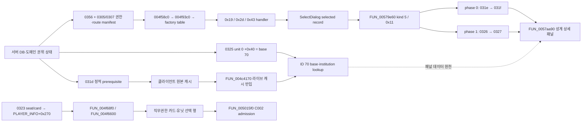

# LOGH VII 전략맵 성계 상세 복원

> [!warning] 현재 판정
> B68b의 성계 관련 라이브 성공은 `0x0325 unit[0]+0x40 spotResolverBase=70 → ID 70 base·institution lookup`까지다. 이후 정적 RE에서 generic info 생산 경로와 whitelist 교집합 factory `0x19/0x2d/0x43`을 찾았다. 서버 권한카드 브리지는 `6720faf2`로 커밋됐고 자동 검증을 통과했다. 현재 열린 경계는 자연 Captain kind `59 → 0x2d`를 실제 패널 출력까지 잇는 B71이다.

이 문서는 전략맵의 성계 상세 데이터가 서버에서 내려와 원본 클라이언트의 상세 패널에 소비되기까지의 현재 계약과 증거를 한곳에 고정한다. 제품 요구사항은 [[logh7-requirements-current|현재 요구사항]], 운영 경계는 [[logh7-architecture-operations-current|현재 아키텍처·운영]]이 상위 권위다. 이 문서는 그 아래의 작업 노트이며, 미확정 필드를 캐논 값으로 승격하지 않는다.

## 목표

전략맵에서 항성·행성·요새·기타 천체를 포함한 성계의 정적 속성, 동적 상태, 시설 정보를 원본 클라이언트가 자연 입력으로 선택하고 상세 UI에 표시하게 한다. 완료 조건은 단순히 패킷을 수신하거나 캐시에 ID가 들어가는 것이 아니라 다음 흐름 전체가 이어지는 것이다.



- **성계 관련 확인됨:** 서버 선택, 정적·동적 cache, `unit[0]+0x40=70`에서 이어지는 ID `70` lookup, factory router와 kind `5/0x11` 생산 경로, `FUN_00579e60 → FUN_0057aa90` 정적 호출 경로.
- **인접 C002로 확인됨:** `0x0323` seat/card와 `PLAYER_INFO+0x270`에서 만들어지는 직무권한 카드·유닛 선택 행, 그 행의 `FUN_005015f0` admission 거부.
- **아직 라이브 미확인:** Captain kind `59` 자연 선택, factory `0x2d`, phase `0/1`, `0x0327`, `FUN_0057aa90(base 70)`을 한 런에서 잇는 B71.

### 2026-07-13 행 소유자 판정 정정

이 문서의 앞선 판정은 `FUN_004f6680/FUN_004f6600` selection row를 성계 목록 행으로 잘못 연결했다. 기존 좌표·카운터 증거는 삭제하지 않고 다음과 같이 소유자를 정정한다.

- `FUN_004f68f0(selectionList,payload)`은 payload를 `selectionList+0x628`에 저장하고 `payload+0x270` count를 `selectionList+0x620`의 `listCount188`로 복사한다.
- `FUN_004f6600`은 `listCount188` 범위의 두 row-object 배열을 `FUN_005015f0`으로 hit-test하고 `listSelected189`를 쓴다. 이는 [[reference/legacy-evidence/logh7-strategic-input-wire|전략 입력 와이어 H1/H2]]의 C002 경로다.
- `payload+0x270`은 `0x0323`의 seat/card count에서 채워지고, 화면의 `職務権限カード` 목록과 결합된다. 따라서 B68b의 `(158,456)` 행과 selection hit `+490`은 **직무카드·유닛 선택 행** 증거다.
- 성계 상세 소비자는 별도 계통이다. `FUN_00579e60`이 generic info selection의 panel kind `5` 또는 `0x11`에서 `FUN_0057aa90(selectedRecord)`을 호출하고, `FUN_0057aa90`은 record `+8`의 base ID로 `0x031f` 데이터를 찾는다.
- generic info 계통의 생산자는 factory router와 handler로 좁혀졌다. C002 행 admission은 여전히 별도 계통이며, 그 성공을 성계 상세 패널 성공 조건이나 증거로 세지 않는다.

### 2026-07-13 generic info 생산자 정적 RE

출력 생산 경로는 다음과 같이 확인됐다.

```text
FUN_004f58c0 → FUN_004f93c0
→ *(0x00c9e2fc + factoryId * 4)
→ handler → FUN_00570eb0 → FUN_00577e70
→ FUN_00579e60 → FUN_0057aa90
```

whitelist와 kind `5/0x11` 생성 경로의 교집합은 세 개다.

| factory | handler | kind | selected record 원천 |
| ---: | --- | ---: | --- |
| `0x19` | `FUN_0058ba40` | `5` | global/current base list, stride `0x180` |
| `0x2d` | `FUN_00582060` | `5` | global/current base list, stride `0x180` |
| `0x43` | `FUN_00585150` | `0x11` | selected-object eligibility vector, stride `0x24` |

renderer는 selected record `+8`의 base ID를 읽는다. `0x41`은 kind `5` 생성 지점이 있으나 whitelist 밖이므로 제품 권한으로 부여하지 않는다.

## 근거 등급과 판정 원칙

| 구분 | 이 문서에서의 의미 |
| --- | --- |
| 소스 오브 트루스 | 현재 코드·테스트, 고정된 와이어 구조, canonical/default 바이너리 해시, 라이브 런 증거에서 직접 확인한 값 |
| 역사 증거 | Git에 보존된 당시 코드·문서·런 기록. 현재 구현에 그대로 적용하지 않고 회귀 원인과 폐기 경로를 판단하는 데만 사용 |
| 추론 | 직접 관측을 설명하는 가장 좁은 가설. 다음 라이브 런이 검증하기 전에는 구현 계약이나 데이터 값으로 승격하지 않음 |

현재 canonical 원본 실행 파일 SHA-256은 `9c97de2ae426f011680992d6c8d88b25488b5f51555ce5784aeef677f334bb51`, 기본 라벨 전용 오버레이 SHA-256은 `e62a8a30dd512cb588fe8ebaa874e24cd3536a99830b40e0a12178ab75c33308`이다.

## 서버에서 소비자까지의 데이터 흐름

### 1. 서버 성계 선택

[`galaxy.json`](../server/content/galaxy.json)을 [`logh7-static-base.mjs`](../server/src/server/logh7-static-base.mjs)가 읽어 1부터 시작하는 런타임 카탈로그 ID를 만든다. 이 ID는 원본 서비스의 역사적 서버 ID라고 단정할 수 없다. 요청에 명시적인 성계 선택자가 있으면 그것을 우선하고, 선택자가 아예 없을 때만 플레이어 셀을 사용한다. 일치하지 않는 선택자나 알 수 없는 셀에 대해 ID 1을 임의로 만들지 않는다.

현재 런에서 플레이어 셀 `2588`은 `ヴァルハラ`와 런타임 카탈로그 ID `70`으로 결합된다. 따라서 이 작업 구간의 세 패킷과 캐시 조인의 기준 ID는 `70`이다.

### 2. 와이어 전송 순서

첫 `0x0f02` 코어 시퀀스는 현재 소스와 테스트 기준으로 다음과 같다.

```text
0204 → 0b09 → 0325 → 0323 → 0b0a → 0313 → 0315 → 031f → 0321 → 0f03 → 0356
```

`0x031d`는 이 목록에 선행 송신 항목으로 보이지 않는다. 클라이언트의 `0x031c` 요청에 반응해 `0x031d`가 전달되기 때문이다. 그래서 B63에서 실제로 관측한 상세 데이터 순서는 다음과 같으며, 두 표현은 충돌하지 않는다.

```text
031c 요청 → 031d 응답 → 031f → 0321 → 0f03
```

`0x031e → 0x031f`, `0x0320 → 0x0321`, `0x0326 → 0x0327` 반응형 경로도 유지한다. 위 월드 진입 수신 순서는 transport 관측이며 상세 renderer의 직접 prerequisite 체인이 아니다. `FUN_00579e60`의 직접 계약은 `0x031d` 정적 캐시가 준비된 상태에서 phase `0`의 `0x031e → 0x031f`, phase `1`의 `0x0326 → 0x0327`을 거쳐 `FUN_0057aa90`으로 가는 것이다. `0x0321`은 institution lookup을 위한 병렬 경로다. 구체적인 세션 순서는 [`logh7-world-session.mjs`](../server/src/server/logh7-world-session.mjs), 레코드 구성은 [`logh7-world-records.mjs`](../server/src/server/logh7-world-records.mjs)에서 확인한다.

### 3. 클라이언트 캐시와 소비자

클라이언트는 `0x031f`와 `0x0321`을 원본 캐시에 디스패치하고, `FUN_004c4170`이 이를 라이브 캐시로 반입한다. `0x0325 unit[0]+0x40`의 `spotResolverBase=70`이 현재 유닛을 이 캐시에 연결한다. 이 결합 뒤에도 UI가 자동으로 열리지는 않는다. `0x0356`과 `0x0305/0x0307`이 권한 있는 factory route를 열고, factory handler가 base ID를 담은 record와 panel kind `5/0x11`을 만들어 `FUN_00579e60 → FUN_0057aa90`으로 넘겨야 한다.

수동 스냅샷과 추적은 [`_frida_strategy_snapshot.js`](../tools/live/_frida_strategy_snapshot.js), [`_strategy_table_probe.py`](../tools/live/_strategy_table_probe.py), [`logh7_agent_drive.py`](../tools/live/logh7_agent_drive.py)를 사용한다. 진짜 선택 성계 ID는 generic info record `+8`에 전달되는 `FUN_0057aa90`의 실제 인자에서만 판정한다. C002의 `listSelected189`를 성계 선택 index로 사용하지 않는다. 과거 `client+0x358`은 선택 ID가 아니라 `clientSpotResolverBase`로 정정됐다.

## 패킷별 고정 계약

| 패킷 | 요청·응답 | 고정 body 크기 | 클라이언트 확장 형태 | 현재 채우는 값 | 미확정 영역 |
| --- | --- | ---: | --- | --- | --- |
| `0x031d` 정적 성계 | `031c → 031d` | `0x520c` = 21,004 bytes | compact stream을 stride `0x3c` 레코드로 확장 | 런타임 ID, grid/cell, 이름 | 종류·천문 속성 등 미명명 필드 |
| `0x031f` 동적 성계 | `031e → 031f` 및 코어 송신 | `0x604` = 1,540 bytes | 최대 4개, stride `0x180` | big-endian ID | 소유·경제 등 스칼라의 정확한 이름↔오프셋↔값 |
| `0x0321` 시설 | `0320 → 0321` 및 코어 송신 | `0x8de4` = 36,324 bytes | 최대 4개, outer stride `0x2378`; 시설 최대 36개 stride `0xfc`; spot 최대 20개 stride `0xc` | 같은 ID, `institution_count=0` | 종류·레벨·HP·생산성의 정확한 필드 정체와 값 |
| `0x0327` phase 1 상세 | `0326 → 0327` | `0x300` = 768 bytes | fixed compact big-endian record | 요청한 base ID | 아직 이름이 고정되지 않은 상세 스칼라 |
| `0x0f03` 월드 진입 | `0f02 → 0f03` 흐름 | `0x1` = 1 byte | 확장 레코드 없음 | status `1`, 상세 캐시 준비 뒤 전송 | 상세 패널 소비를 대신하지 않음 |

`0x031d` body는 `u16be count` 뒤에 compact 레코드가 이어지는 파서 스트림이다. `0x031f`의 배열은 30/30/6/5/3 상한과 오프셋이 고정됐지만 각 스칼라의 의미는 아직 증명되지 않았다. 자세한 역공학 근거는 [[reference/legacy-evidence/logh7-info-records-wire|정보 레코드 와이어 RE]], [[reference/legacy-evidence/logh7-proto-info-records|시설·경제 레코드 RE]], 배치 데이터는 [[logh7-strategic-map-placement-re|전략맵 오브젝트 배치 와이어 계약]]을 따른다.

인코더 구현은 [`base-record.mjs`](../server/src/server/codec/base-record.mjs)와 [`institution-record.mjs`](../server/src/server/codec/institution-record.mjs)에 있다.

## 왜 현재 `id-only`, `facilities=0`인가

현재 `0x031f`가 ID만 보내고 `0x0321`이 시설 수 0을 보내는 것은 전송 실패나 데이터 누락 버그로 확정된 상태가 아니다. 오히려 확인되지 않은 값을 지어내지 않기 위한 의도적인 보수 계약이다.

- `0x031f`는 레코드 구조와 배열 경계까지 확인했지만, 소유권·경제 상태로 보이는 스칼라의 이름, 정확한 오프셋, 현재 값의 세 쌍이 결합되지 않았다. 따라서 ID 외 값을 채우면 클라이언트가 읽더라도 가짜 상태가 된다.
- `0x0321`은 외부·시설·spot stride와 개수 상한을 알지만 종류·레벨·HP·생산성 필드의 의미와 서버 원천 값이 결합되지 않았다. 그래서 같은 성계 ID와 `institution_count=0`만 보낸다.
- B70에서도 cache join은 성공했지만 권한 있는 factory route와 phase `1`이 시작되지 않아 `0x0327`과 `FUN_0057aa90`이 관측되지 않았다. B71에서 renderer가 실제로 읽는 오프셋을 고정하기 전에 payload를 넓히면 UI 진전과 무관한 변수를 추가해 병목 진단을 흐린다.

그러므로 다음 순서는 **올바른 자연 선택으로 소비자를 깨운 뒤**, 실제 읽힌 오프셋만 증거가 고정된 원천 데이터와 결합하는 것이다. 시설을 임의 생성하지 않는다.

## 라이브 증거

### B63 — 전송·캐시 결합 확인

근거: [`system-detail-verdict.json`](../.omo/live-qa/m3-system-detail-B63-wire-cache-join-20260713/system-detail-verdict.json)

판정은 `partial`이다.

- 로그인 게이트 통과, 클라이언트 생존.
- 서버 송신, 클라이언트 수신, 디스패치 순서가 모두 `031d → 031f → 0321 → 0f03`.
- 정적 캐시는 imported·active, `031f`·`0321` 원본 캐시와 라이브 캐시는 모두 complete이며 ID `70`으로 결합.
- 선택 성계 ID `0`, unit resolver `0`, 기본 정보 조회 `0`, 시설 조회 `0`, 패널 호출 `0`.

따라서 B63은 **서버→와이어→클라이언트 캐시** 구간을 닫았고, 다음 병목을 자연 성계 선택 이후의 소비자로 좁혔다. 상세 UI가 실패했다고 판정한 런은 아니다.

### B67 — 마커 입력과 목록 count 변화 관측, 목록 소유자 정정

근거 디렉터리: [`m3-system-detail-B67-short-click-system-row-20260713`](../.omo/live-qa/m3-system-detail-B67-short-click-system-row-20260713/)

유효한 관측은 다음과 같다.

- world-entry gate 성공, 캐시 준비 완료, 세 상세 패킷과 `0x0f03`의 수신·디스패치 확인.
- `0x031f`·`0x0321` 원본·라이브 캐시에 ID `70` 확인.
- 마커 reference 좌표 `(515,390)`, screen 좌표 `(513,388)` 클릭 뒤 관측 중인 selection list count가 `16 → 1`로 바뀌고 `payloadWord26c=258 (0x0102)`가 기록됨.

그러나 행 클릭은 유효하지 않다. 하네스가 `selection.origin=(0,0)`을 절대 화면 원점처럼 사용해 local row rect `(0,0,316,32)`의 중앙을 reference `(158,16)`, screen `(156,14)`로 계산했다. [`strategy-system-row-after.png`](../.omo/live-qa/m3-system-detail-B67-short-click-system-row-20260713/shots/strategy-system-row-after.png)를 보면 커서는 화면 왼쪽 위에 있고, 실제 C002 직무카드·유닛 선택 패널은 왼쪽 아래 대략 `y=438–516`에 있다. 현재 화면 스케일 기준 그 목록의 첫 행 후보는 reference `(158,456)` 부근이다.

> [!important] B67 좌표 정정
> B67은 **전략맵 마커 입력**과 selection list count의 동시 변화를 관측했다. 그러나 해당 list는 `PLAYER_INFO+0x270` 기반 C002 목록이므로 `16 → 1`을 단일 성계 목록 전환으로 판정하지 않는다. 잘못된 좌표 뒤의 selection hit·index·panel 값도 성계 상세 소비 증거가 아니다.

### B68b — 성계 lookup 복원과 C002 행 admission의 분리

근거 디렉터리: [`m3-system-detail-B68b-spot-resolver-row-20260713`](../.omo/live-qa/m3-system-detail-B68b-spot-resolver-row-20260713/)

신뢰된 기본 오버레이 SHA-256 `e62a8a30dd512cb588fe8ebaa874e24cd3536a99830b40e0a12178ab75c33308`로 world-entry gate를 통과했다. `0x031d/0x031f/0x0321/0x0f03` 수신·디스패치와 ID `70` 캐시 조인은 모두 complete였다.

- 서버 수정 뒤 `unit0SpotResolverBase=70`을 라이브 메모리에서 확인했다. `clientSpotResolverBase`(`client+0x358`)는 계속 `0`이며, UI 선택 ID가 아니라는 기존 정정과 일치한다.
- 행 클릭은 reference `(158,456)`, screen `(156,454)`, source `hud-mode1-fixed`였다. [`strategy-system-row-after.png`](../.omo/live-qa/m3-system-detail-B68b-spot-resolver-row-20260713/shots/strategy-system-row-after.png)에서 커서가 실제 왼쪽 아래 패널 안에 있음을 확인했다. 정적 소유자 대조 결과 이 패널은 성계 목록이 아니라 `PLAYER_INFO+0x270` 기반 직무카드·유닛 선택(C002) 목록이다.
- base `0x031f` lookup과 institution `0x0321` lookup은 각각 baseline `107 → 352`, 최종 delta `+245`였다. bounded ring에는 `arg0=70`, `found=true`가 반복 기록됐다. 클릭 전 baseline부터 이미 107회였으므로 `+245`를 행 클릭의 인과 효과로 해석하지 않고, ID `70` lookup 경로가 계속 활성이라는 증거로만 쓴다.
- C002 selection hit 최종 delta는 `+490`이지만 accepted `0`, rejected `490`이다. 마지막 `controllerGate05=0`이다.
- C002 `listSelected189` 계열 index의 in-range·changed는 모두 `0`이다. generic info selection과 `FUN_0057aa90` 상세 패널 호출도 `0`이지만, 이 probe가 올바른 성계 입력 생산자를 구동하지 않았으므로 성계 실패 원인 판정에는 쓰지 않는다.

따라서 B68b의 성계 판정은 **unit→base ID→base/institution lookup**까지다. `(158,456)` 행의 `FUN_005015f0 controller+5=0`은 인접 C002 admission의 첫 관측 실패점이며 성계 상세의 병목이 아니다. gate 뒤의 geometry·`latchB00`도 C002 독립 조건으로 남는다. 첫 `m3-system-detail-B68-spot-resolver-row-20260713` 런은 world-entry gate 실패를 낸 lobby automation-invalid 런이므로 판정에서 제외한다.

### B70 — cache 성공, 권한 route·phase 미시작

근거 디렉터리: [`m3-system-output-B70-natural-20260713`](../.omo/live-qa/m3-system-output-B70-natural-20260713/)

B70은 로그인·월드 진입·cache join과 클라이언트 생존을 확인했다. `FUN_00579e60`, `FUN_0057aa90`, `0x0326/0x0327`은 `0`이었다. 당시 tracer가 factory `0x41` 전용이었으므로 `0x19/0x2d/0x43` handler별 호출을 0으로 확정하지 않는다. B70의 `1f683df0` 기능 기준선이 natural Captain `0x2d` route를 만들지 않아 authorized phase `1`을 시작하지 못한 런으로 판정한다.

당시 verdict의 `factory41Granted`와 이를 first missing으로 본 판정은 폐기한다. `0x41`은 whitelist 밖이라 제품 권한이 아니다. 옛 parser도 runtime outer count `2`를 넘어 읽어 garbage category `15`, raw count `229`를 만들었다. count over-read와 phase 계측은 `1f683df0`에서 고쳤지만, HEAD tracer의 factory `0x41` 전제는 아직 route-aware tracer로 교체되지 않았다.

### HUD 오른쪽 아래 버튼 라벨·동작

통합 판정: [`summary.json`](../.omo/live-qa/m3-strategy-hud-label-fix-20260713/summary.json)

공식 매뉴얼과 `FUN_004fd100` 핸들러를 대조해 왼쪽은 `職務権限カード`, 오른쪽은 `メンバーリスト`로 확정했다. guarded patch 9개를 적용한 현재 오버레이가 위의 `e62a8a30…` SHA다.

- 왼쪽 증거 `.omo/live-qa/m3-strategy-hud-label-fix-left-20260713`: child 9/event `0xa4`가 `FUN_004fd7a0(2,1)`을 호출하며 HUD mode `1 → 2` 성공.
- 오른쪽 증거 `.omo/live-qa/m3-strategy-hud-label-fix-right3-20260713`: child 8/event `0xa5`가 `FUN_004fd7a0(6,1)`을 호출하며 HUD mode `1 → 6` 성공.
- 유효 런에서 두 문구를 화면으로 확인했고 크래시는 없었다. 정리 뒤 클라이언트 프로세스와 TCP 47900 listener도 각각 0이었다.

### 정적 RE — 인접 C002 HUD mode 2와 selection table

`FUN_004fd7a0`의 정적 호출 흐름은 B68b에서 잘못 성계 행으로 불렀던 **직무카드·유닛 선택 행**의 거부를 설명할 인접 C002 검증 가설을 준다.

1. 이 함수는 허용된 모든 HUD mode 진입에서 먼저 `FUN_004f6680(1)`을 호출한다.
2. selection tab/mode table 1의 첫 dword는 `-1`이다. `FUN_004f6680(1)`은 이 정의를 따라 selection root `+4/+5`를 닫는다.
3. HUD mode가 `2`이면 이어서 `FUN_004f6680(3-bVar9)`을 호출한다. `bVar9`는 boolean이므로 실제 인자는 `2` 또는 `3`이고, 두 table의 첫 dword는 `0`이라 유효 selection root를 열 수 있다. 어느 table이 선택되는지는 라이브 context와 함께 확인해야 한다.

B68b C002 행 입력 때 `HUD modeF4=1`이었고 `FUN_005015f0`의 첫 관측 실패 조건이 `controller+5=0`이었다. 따라서 mode 1의 table 1 적용으로 root가 닫힌 자연스러운 상태였을 가능성이 높다. 다만 B68b는 `FUN_004fd7a0 → FUN_004f6680 → root +4/+5 → FUN_005015f0`을 한 타임라인으로 상관 관측하지 않았으므로 **C002 근본 원인 확정이 아니라 B69 가설**이다. 이 가설은 성계 상세 패널 경로를 설명하지 않는다.

B69는 메모리나 gate를 쓰지 않고 다음 인접 C002 자연 경로만 검증한다.

```text
왼쪽 職務権限カード (child 9 / event 0xa4)
→ FUN_004fd7a0(2,1), HUD mode 1 → 2
→ FUN_004f6680(1) 초기 닫힘
→ FUN_004f6680(2 또는 3), selection table 2/3 적용
→ PLAYER_INFO+0x270 기반 직무카드·유닛 행 입력
→ FUN_004f6600 / FUN_005015f0 C002 admission
→ listSelected189, geometry, latchB00
```

판정은 `FUN_004f6680(2/3)`과 root `+4/+5`의 자연 전이, 이어지는 C002 admission 결과를 같은 런에서 관측해야 한다. `controller+5`, `gate05`, `latchB00` 강제 쓰기는 하지 않는다. 이 경로는 `unit[0]+0x40=70 → ID 70 lookup` 및 `FUN_00579e60 → FUN_0057aa90` 성계 상세 경로와 별개이며, B69 성공도 성계 상세 성공 증거가 아니다.

## 역사적 안정판과 크래시 원인

Git 로그와 보존 문서를 대조한 결과, 과거에 안정적으로 월드·데이터·캐시·성계 화면까지 진입한 빌드는 있었지만 **전략맵 성계 입력 → generic info selection kind `5/0x11` → `FUN_0057aa90` 상세 패널** 전체가 성공했다는 역사 증거는 찾지 못했다.

커밋 `2bffc4f5`의 `docs/logh7-loop-cycle-2026-06-21-endpoint-render.md` 92–93행은 당시 안정 실행 파일 SHA 접두사 `7c3abbade961…`와 크래시 빌드 SHA 접두사 `321aafcf…`를 비교한다. 실행 스택의 유일한 차이는 `chat-target-labels-ko` code-cave 우회 `0x516038 → 0x76e72d`였고, 이를 제거하면 정확히 안정 SHA와 정상 시작이 복원됐다. 그 우회 패치는 기본 경로에서 제거됐으며 명세만 역사 자료로 남았다. 이 사실은 현재 기본 라벨 전용 오버레이가 같은 문제라는 뜻이 아니다.

역사적으로 명확히 확인된 다른 전략맵 크래시에는 `0x0325` count/endian 오류와 누락 unit ID가 있었다. 현재 B63/B67은 클라이언트 생존과 캐시 결합을 확인했으므로, 그것들을 현재 소비 병목의 설명으로 재사용하지 않는다.

### 폐기하거나 격리한 가설

- `chat-target-labels-ko` code cave를 다시 기본 경로에 넣지 않는다.
- `gate05`, `target+5`, 전역 상태를 강제로 쓰는 경로는 실패하거나 malformed `0x0b01`을 만들었으므로 정식 해결책으로 승격하지 않는다.
- 과거 절대 좌표와 오래된 HUD mode 좌표를 현재 화면에 재사용하지 않는다. B43/B68의 selection geometry는 C002 직무카드·유닛 목록 증거이며 성계 상세 입력 좌표로 재사용하지 않는다.
- mid-function hook은 크래시를 유발했으므로 함수 경계와 수동 관측 hook만 쓴다.
- [[reference/legacy-evidence/logh7-mode0-breakthrough-2026-06-26|mode0 소비 게이트 역사 증거]]의 강제 활성화는 60회 이상 no-op·오염이 확인됐고, collection이 비어 있는 상태의 byte0-only 활성화도 무효다.

## 현재 병목

전송·수신·디스패치·cache, `unit[0]+0x40=70`, generic info factory 생산 경로까지 닫혔다. `6720faf2`가 personal kind `0`과 Captain kind `59/195`의 서버 권한 manifest를 교정해 커밋했다. 현재 열린 경계는 원본 UI에서 자연 factory `0x2d` route가 실제로 열리는지 확인하는 B71이다.

```text
서버 authorityCards
→ 0356 {kind, spot}
→ 0305/0307 kind별 factory 목록
→ Captain kind 59의 0x2d
→ FUN_00582060 → FUN_00570eb0(kind 5)
→ selected record +8 = base 70
→ FUN_00579e60 phase 0/1
→ 031f + 0327
→ FUN_0057aa90
```

canonical 기본 grant는 personal kind `0`에 빈 명령, 제국 일반 Captain kind `59`와 동맹 일반 Captain kind `195`에 `[0x2b,0x2d]`다. 반란 kind `123/257`은 camp 증거 없이 부여하지 않는다. `0x41/0x43`도 기본 grant에서 제외한다.

커밋 `6720faf2`의 16개 파일은 authority-card 도메인, SQLite/JSON persistence와 backfill, `0x0356`, 세션 전파, `0x0305/0x0307` padding과 Captain grant를 구현했다. 독립 자동 검증은 집중 `128/128`, 전체 `393/393`, diff-check와 placeholder scan 통과다. B71 라이브 전이며, 명시적 `authorityCards: []` 의미, DB 교체 transaction, grant/revoke API, `seat count` 테스트 명칭은 리뷰 후보로 남아 있다. 자세한 재개 순서는 [[logh7-m4-strategy-system-detail-handoff-2026-07-13|M4 전략 성계 상세 핸드오프]]를 따른다.

## B71 자연 출력 체크리스트

- 권장 증거 디렉터리: `.omo/live-qa/m3-system-output-B71-captain-0x2d-natural-20260713`.
- QA command injection을 사용하지 않는다.
- 자연 `職務権限カード`에서 제국 Captain kind `59`를 선택한다.
- factory `0x2d`를 누르되 실제 이동 확인은 누르지 않는다.
- `0x0305/0x0307`은 category `0..59`의 `60`행, kind `59`의 `[0x2b,0x2d]`를 보여야 한다.
- handler `FUN_00582060`, kind `5`, selected record `+8=70`을 확인한다.
- phase `0`의 `0x031e → 0x031f`, phase `1`의 `0x0326 → 0x0327`을 한 타임라인에서 확인한다.
- `FUN_00579e60 → FUN_0057aa90`과 클라이언트 생존을 확인한다.
- 정리 뒤 G7/Gin7 프로세스와 TCP `47900` listener가 모두 없어야 한다.

자연 경로가 실패할 때만 별도 B72에서 명시적 QA-only `0x2d` injection positive control을 쓴다. B72는 B71 성공으로 합치지 않는다.

## 관련 문서와 코드

- [[logh7-document-index-current|현재 문서 인덱스]]
- [[logh7-m4-strategy-system-detail-handoff-2026-07-13|M4 전략 성계 상세 핸드오프]]
- [[logh7-requirements-current|현재 요구사항]]
- [[logh7-architecture-operations-current|현재 아키텍처·운영]]
- [[logh7-strategic-map-placement-re|전략맵 오브젝트 배치 와이어 계약]]
- [[logh7-debug-journal-20260712|전략맵 디버그 저널]]
- [[reference/legacy-evidence/logh7-info-records-wire|정보 레코드 와이어 RE]]
- [[reference/legacy-evidence/logh7-proto-info-records|시설·경제 레코드 RE]]
- [[reference/legacy-evidence/logh7-mode0-breakthrough-2026-06-26|mode0 소비 게이트 역사 증거]]
- [`logh7-world-session.mjs`](../server/src/server/logh7-world-session.mjs)
- [`logh7-world-records.mjs`](../server/src/server/logh7-world-records.mjs)
- [`logh7-static-base.mjs`](../server/src/server/logh7-static-base.mjs)
- [`base-record.mjs`](../server/src/server/codec/base-record.mjs)
- [`institution-record.mjs`](../server/src/server/codec/institution-record.mjs)
- [`_frida_strategy_snapshot.js`](../tools/live/_frida_strategy_snapshot.js)
- [`_strategy_table_probe.py`](../tools/live/_strategy_table_probe.py)
- [`logh7_agent_drive.py`](../tools/live/logh7_agent_drive.py)
