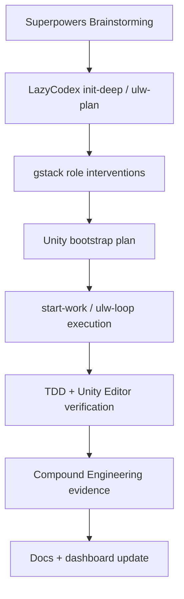

# LOGH VII Unity Bootstrap Harness Design

Date: 2026-07-03

## Intent

Rebuild LOGH VII as an evidence-driven Unity client and server/data package, not as a modified legacy D3D8 client. The original game content must remain the canonical baseline: installed resources, manuals, extracted data, reverse-engineering traces, and generated server catalogs all feed the Unity project through explicit manifests and verification gates.

The harness is the development process, not only a script. It must force each Unity bootstrap slice through LazyCodex, Superpowers, gstack role review, CodeGraph/LSP, and Compound Engineering evidence capture before work is treated as ready.

## Starting Evidence

- Unity Editor is installed at `E:/Unity/hub/6000.5.2f1/Editor/Unity.exe`.
- `client-unity/README.md` currently reserves the Unity client boundary but has no Unity project files.
- `server/content/` contains canonical extracted/manual/source data, including galaxy, roster, scenario, manual, localization, and original-source manifests.
- `server/content/generated/` contains generated catalogs for MDX, TCF faces, portraits, logistics allocation, operations, rank promotion, ship stats, strategy commands, and Null_galaxy templates.
- `server/src/server/` contains evidence-backed catalog/rule modules and the first operation state reducer.
- Legacy client live validation remains diagnostic/oracle-only. `ui_explorer`, direct EXE launch, Frida, trace tools, preseed flags, and direct legacy runtime paths must not become normal Unity/operator workflow.

## Harness Shape

## Required Capability Gates

### 1. Superpowers Brainstorming Gate

Purpose: decide what the Unity bootstrap must prove before any project scaffolding or game code is written.

Required behavior:
- Ask or resolve product-shaping questions before implementation.
- Present 2-3 approaches and record the chosen approach.
- Write this design document under `docs/superpowers/specs/`.
- Stop for user review before writing an implementation plan.

Chosen approach:
- Build the Unity Bootstrap Harness first.
- Fold content migration and gameplay logic contracts into that harness as mandatory sub-gates.
- Avoid a visual mock-first Unity project because it risks drifting from the canonical original game content.

### 2. LazyCodex / OMO Gate

Purpose: make Unity work follow the existing LOGH VII loop rather than becoming an ad hoc client rewrite.

Required steps:
- `$init-deep`: refresh directory rules and startup knowledge when workflow boundaries change.
- `$ulw-plan`: produce the decision-complete implementation plan after this design is approved.
- `$start-work`: execute the approved plan with evidence ledger updates.
- `$ulw-loop`: continue smallest actionable slices until the broader Unity/data/game-logic objective is actually satisfied.
- CodeGraph first for code location, subsystem, call-path, and blast-radius questions when `.codegraph/` exists.
- Git Bash before PowerShell shell work on Windows unless a task requires PowerShell.
- LSP diagnostics on changed source files and Unity C# files once C# project files exist.

### 3. gstack Role Intervention Gate

Purpose: make gstack roles actively shape the plan, not sit outside it.

Required role slots:
- `/office-hours`: pressure-test the narrowest playable wedge and whether the Unity rebuild is solving the right problem.
- `/plan-ceo-review`: challenge scope, especially the requirement that the existing game content must all enter the canonical baseline.
- `/plan-eng-review`: review Unity project structure, data flow, catalog import, gameplay contract boundaries, tests, and failure modes.
- `/plan-devex-review`: review repeatability for future agents and developers: commands, Editor path, manifests, data regeneration, and onboarding.
- `/plan-design-review`: review the first Unity data/debug screen and eventual strategic map UX before UI implementation.
- `/review` or `omo:review-work`: run post-implementation review before any broad readiness claim.

If a role cannot be run in the active environment, the plan must record the attempted command or policy reason, the skipped gate, and how the replacement evidence is weaker.

### 4. Content Migration Gate

Purpose: guarantee that "existing game content all goes in" is tracked as a real requirement.

Required content classes:
- Original source provenance: `server/content/original-data/`.
- Installed game data: `.omo/work/logh7-installed/data/`, fonts, and docs.
- Canonical normalized data: `server/content/*.json`, `server/content/manual/`, `server/content/roster/`, `server/content/scenarios/`, localization and name data.
- Generated catalogs: `server/content/generated/*.json`.
- Reverse-engineering evidence: `.omo/ghidra/`, `RE/content/`, debug journals, and selected legacy evidence docs through `docs/logh7-document-index-current.md`.
- Visual/audio/model assets: TCF portraits, BMP/TGA/JPG textures, MDX/MDS models, WAV/OGG sounds, and manual/sourcebook visual evidence.

Required output:
- A Unity import manifest that lists every content class, source path, generated destination, status, byte counts or record counts where practical, and known gaps.
- A missing-content ledger that distinguishes "not yet imported" from "unknown source" and "intentionally diagnostic-only."

### 5. Unity Project Gate

Purpose: turn `client-unity/` from a placeholder into a real Unity project without losing evidence boundaries.

Required constraints:
- Unity version target: `6000.5.2f1`.
- Project root: `client-unity/`.
- Canonical data intake path: `Assets/StreamingAssets/LOGH7/` unless an approved Unity Addressables plan replaces it.
- First Unity scene must be a data verification surface, not a marketing/menu mock.
- Unity must read manifests generated from server/source data; it must not independently infer game rules from loose JSON.
- Generated Unity assets must be reproducible from source manifests or clearly marked as human-authored client code.

Initial Unity deliverable:
- A Unity project that opens in batchmode.
- A manifest loader that can read the LOGH7 seed manifest.
- A minimal verification scene or EditMode test proving that canonical data was loaded.

### 6. Gameplay Logic Contract Gate

Purpose: prevent Unity from becoming a second speculative rules engine.

Required constraints:
- Server/data modules remain the authority for evidence-backed catalogs, explicit rules, and game-state reducers.
- Unity consumes contracts generated from those modules.
- First contract candidates:
  - galaxy/system data for strategic map bootstrap,
  - roster and rank data for character/fleet inspection,
  - strategy command catalog for command UI,
  - operation catalog/rules/state reducer for first state-changing gameplay slice.
- Unresolved formulas remain visible as unresolved in Unity; do not invent CP formulas, battle outcomes, AI behavior, or economics without evidence.

### 7. Verification Gate

Purpose: make every Unity slice observable.

Required checks:
- Server catalog tests and syntax checks for data-producing modules.
- Unity batchmode project open or test run using the installed Editor path.
- EditMode or PlayMode test for manifest loading once Unity project files exist.
- Manual QA through the matching Unity surface when a visual scene exists.
- LSP diagnostics for changed `.mjs`, `.js`, `.cs`, `.json`, and HTML/docs where supported.
- No success claim based only on file creation or green server tests.

### 8. Compound Engineering Gate

Purpose: make decisions reusable across long LOGH VII loops.

Each work unit records:
- Plan path.
- Files changed.
- Commands run and results.
- Evidence path under `.omo/ulw-loop/evidence/`.
- Which LazyCodex, Superpowers, gstack, CodeGraph, LSP, and Unity gates ran.
- Which gates were skipped, why, and what weaker evidence replaced them.
- Mistake or near-miss if any, root cause, reusable guard, and where the guard is stored.

## First Implementation Plan Boundary

The first implementation plan after this design should not try to port gameplay wholesale. It should create the smallest Unity project that proves the harness:

1. Generate or copy a LOGH7 Unity seed manifest from current server/source data.
2. Create/open `client-unity/` as a Unity 6000.5.2f1 project.
3. Add a minimal C# manifest loader and test surface.
4. Run Unity batchmode validation.
5. Update current docs and dashboard with the new Unity bootstrap status.

## Non-Goals

- Do not patch `G7MTClient.exe`.
- Do not restore Python/JSON EXE patch builders.
- Do not make direct legacy client launch a normal runtime path.
- Do not build a Unity mock that is disconnected from canonical LOGH VII content.
- Do not implement speculative combat, economy, AI, or CP formulas.
- Do not treat "catalog copied" as "content migration complete"; migration requires tracked coverage and gaps.

## Open Review Points

- Whether Unity data should start with `StreamingAssets` only or introduce Addressables in the second slice.
- Whether the first visible Unity scene should be a strategic map data viewer or a content inventory dashboard.
- Whether generated Unity C# contract types should be handwritten first or generated from JSON schemas after the manifest loader proves the path.

Recommended defaults:
- Start with `StreamingAssets`.
- First scene: content inventory plus minimal galaxy/system list.
- Handwrite the first C# loader and model types, then generate schemas/types once the data contract stabilizes.
